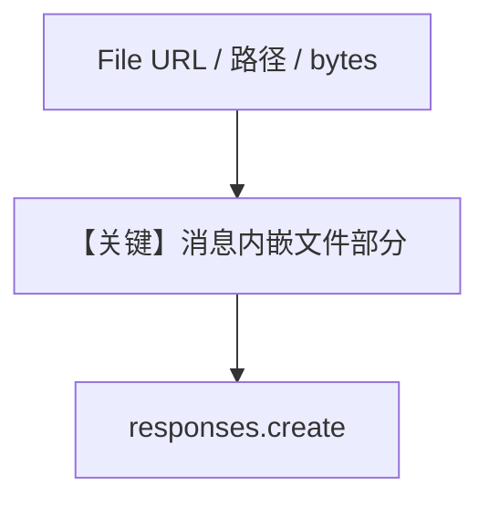

# file_input_direct.py — 实现原理分析

> 源文件：`cookbook/90_models/openai/responses/file_input_direct.py`

## 概述

本示例展示 Agno 的 **`File` 多来源输入** 机制：通过 URL、本地路径、原始字节三种方式把 PDF/CSV 交给 `OpenAIResponses`，由 Responses API 多模态/文件输入处理。

**核心配置一览：**

| 配置项 | 值 | 说明 |
|--------|------|------|
| `model` | `OpenAIResponses(id="gpt-4o")` | Responses API |
| `markdown` | `True` | Markdown 附加段 |

## 架构分层

```
用户代码层                agno.agent 层
┌──────────────────┐    ┌──────────────────────────────────┐
│ print_response   │───>│ files=[File(...)] 进入消息组装       │
│ File url/path/   │    │ _format_messages → Responses input   │
│ bytes            │    └──────────────────────────────────┘
└──────────────────┘
```

## 核心组件解析

### agno.media.File

`File(url=...)`、`File(filepath=..., mime_type=...)`、`File(content=..., filename=..., mime_type=...)` 分别对应远程、本地、内存内容。

### 运行机制与因果链

1. **路径**：用户问题 + `files` → `get_run_messages` 将文件部分并入用户/多模态消息 → `responses.create`。
2. **状态**：无持久化；三次 `print_response` 在 `__main__` 中顺序执行。
3. **分支**：不同 `File` 构造子走不同序列化分支（下载 URL、读盘、内联 bytes）。
4. **定位**：与 `pdf_input_*` 互补，本文件强调 **统一 File API 三种形态**。

## System Prompt 组装

无自定义 `instructions`；`markdown=True`。

### 还原后的完整 System 文本

```text
<additional_information>
- Use markdown to format your answers.
</additional_information>

```

## 完整 API 请求

`input` 数组中含文本与文件引用（具体结构由 `OpenAIResponses._format_messages` 决定）。

## Mermaid 流程图



## 关键源码文件索引

| 文件 | 关键函数/类 | 作用 |
|------|------------|------|
| `agno/media/` | `File` | 文件载荷 |
| `agno/models/openai/responses.py` | `_format_messages` | 转 API input |
