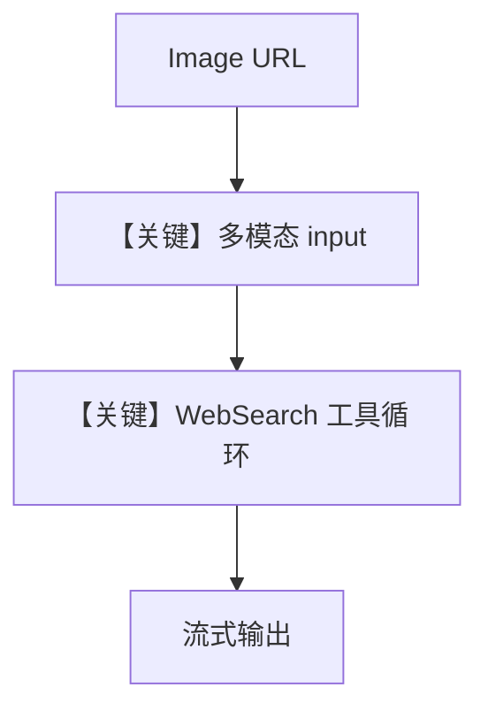

# image_agent.py — 实现原理分析

> 源文件：`cookbook/90_models/openai/responses/image_agent.py`

## 概述

本示例展示 Agno 的 **`Image` URL + `WebSearchTools`** 机制：视觉模型读图并结合联网搜索回答「图片内容 + 相关新闻」。

**核心配置一览：**

| 配置项 | 值 | 说明 |
|--------|------|------|
| `model` | `OpenAIResponses(id="gpt-4o")` | 多模态 Responses |
| `tools` | `[WebSearchTools()]` | 搜索 |
| `markdown` | `True` | Markdown 附加段 |

## 架构分层

```
用户代码层                agno.agent 层
┌──────────────────┐    ┌──────────────────────────────────┐
│ images=[Image(url)]│──>│ get_run_messages 含图片 + 工具      │
└──────────────────┘    └──────────────────────────────────┘
                                ▼
                        responses.create + tools
```

## 核心组件解析

### Image(url=...)

图片经消息格式化进入模型输入；流式 `stream=True` 走 `invoke_stream`。

### 运行机制与因果链

1. **路径**：用户文本 + 图像 + 工具 → 可能多轮工具调用再回答。
2. **状态**：无会话历史配置。
3. **分支**：无图则退化为纯文本+搜索。
4. **定位**：与 `image_agent_bytes.py` 对照，本文件用 **URL 图像**。

## System Prompt 组装

### 还原后的完整 System 文本

```text
<additional_information>
- Use markdown to format your answers.
</additional_information>

```

## 完整 API 请求

```python
client.responses.create(
    model="gpt-4o",
    input=[...],  # 图文 + 工具
    tools=[...],
    stream=True,
)
```

## Mermaid 流程图



## 关键源码文件索引

| 文件 | 关键函数/类 | 作用 |
|------|------------|------|
| `agno/media/` | `Image` | 图像载荷 |
| `agno/models/openai/responses.py` | `invoke_stream` L811 | 流式 Responses |
