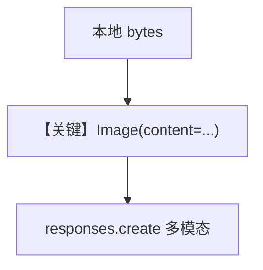

# image_agent_bytes.py — 实现原理分析

<!-- cookbook-py-source:start -->
## 完整源码

```python
"""
Openai Image Agent Bytes
========================

Cookbook example for `openai/responses/image_agent_bytes.py`.
"""

from pathlib import Path

from agno.agent import Agent
from agno.media import Image
from agno.models.openai import OpenAIResponses
from agno.tools.websearch import WebSearchTools
from agno.utils.media import download_image

# ---------------------------------------------------------------------------
# Create Agent
# ---------------------------------------------------------------------------

agent = Agent(
    model=OpenAIResponses(id="gpt-4o"),
    tools=[WebSearchTools()],
    markdown=True,
)

image_path = Path(__file__).parent.joinpath("sample.jpg")

download_image(
    url="https://upload.wikimedia.org/wikipedia/commons/0/0c/GoldenGateBridge-001.jpg",
    output_path=str(image_path),
)

# Read the image file content as bytes
image_bytes = image_path.read_bytes()

agent.print_response(
    "Tell me about this image and give me the latest news about it.",
    images=[
        Image(content=image_bytes),
    ],
    stream=True,
)

# ---------------------------------------------------------------------------
# Run Agent
# ---------------------------------------------------------------------------

if __name__ == "__main__":
    pass
```

<!-- cookbook-py-source:end -->

> 源文件：`cookbook/90_models/openai/responses/image_agent_bytes.py`

## 概述

本示例展示 Agno 的 **`Image(content=bytes)`** 机制：从本地下载图片读入字节，避免依赖可公网 URL，仍走 `OpenAIResponses` 多模态路径。

**核心配置一览：**

| 配置项 | 值 | 说明 |
|--------|------|------|
| `model` | `OpenAIResponses(id="gpt-4o")` | Responses |
| `tools` | `[WebSearchTools()]` | 搜索 |
| `markdown` | `True` | Markdown 附加段 |

## 核心组件解析

### download_image + read_bytes

先 `download_image` 落盘，再 `read_bytes` 传入 `Image(content=image_bytes)`，适合离线或私有图像管线。

### 运行机制与因果链

1. **路径**：字节图像与文本进入同一 run → 工具可选。
2. **状态**：临时文件在脚本目录；无 DB。
3. **分支**：与 `Image(url=...)` 序列化路径不同，底层均汇入模型多模态输入。
4. **定位**：**字节图像** 相对 `image_agent.py` 的 URL。

## System Prompt 组装

### 还原后的完整 System 文本

```text
<additional_information>
- Use markdown to format your answers.
</additional_information>

```

## Mermaid 流程图



## 关键源码文件索引

| 文件 | 关键函数/类 | 作用 |
|------|------------|------|
| `agno/utils/media.py` | `download_image` | 下载图像 |
| `agno/media/` | `Image` | 字节内容 |
