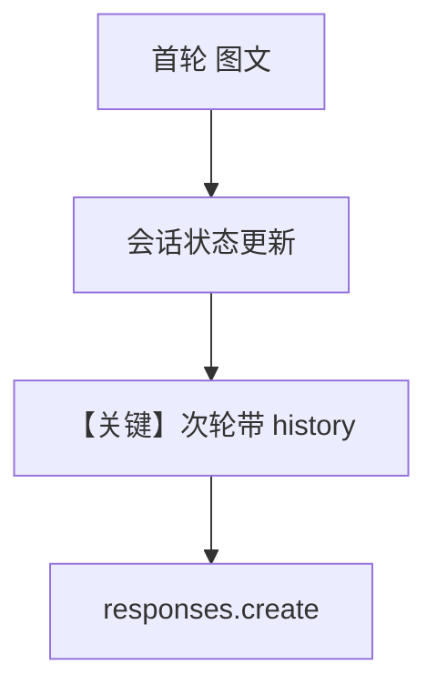

# image_agent_with_memory.py — 实现原理分析

<!-- cookbook-py-source:start -->
## 完整源码

```python
"""
Openai Image Agent With Memory
==============================

Cookbook example for `openai/responses/image_agent_with_memory.py`.
"""

from agno.agent import Agent
from agno.media import Image
from agno.models.openai import OpenAIResponses
from agno.tools.websearch import WebSearchTools

# ---------------------------------------------------------------------------
# Create Agent
# ---------------------------------------------------------------------------

agent = Agent(
    model=OpenAIResponses(id="gpt-4o"),
    tools=[WebSearchTools()],
    markdown=True,
    add_history_to_context=True,
    num_history_runs=3,
)

agent.print_response(
    "Tell me about this image and give me the latest news about it.",
    images=[
        Image(
            url="https://upload.wikimedia.org/wikipedia/commons/0/0c/GoldenGateBridge-001.jpg"
        )
    ],
)

agent.print_response("Tell me where I can get more images?")

# ---------------------------------------------------------------------------
# Run Agent
# ---------------------------------------------------------------------------

if __name__ == "__main__":
    pass
```

<!-- cookbook-py-source:end -->

> 源文件：`cookbook/90_models/openai/responses/image_agent_with_memory.py`

## 概述

本示例展示 Agno 的 **`add_history_to_context` + 多模态首轮** 机制：首轮图文，次轮纯文本可依赖会话历史（「更多图片」与上文相关）。

**核心配置一览：**

| 配置项 | 值 | 说明 |
|--------|------|------|
| `model` | `OpenAIResponses(id="gpt-4o")` | Responses |
| `tools` | `[WebSearchTools()]` | 搜索 |
| `markdown` | `True` | Markdown |
| `add_history_to_context` | `True` | 注入历史 |
| `num_history_runs` | `3` | 最近 3 轮 |

## 运行机制与因果链

1. **路径**：第一轮带 `Image`；第二轮 `"Tell me where I can get more images?"` 依赖历史中的图像与回答。
2. **状态**：会话内历史（内存或默认 session 存储，取决于 Agent 配置）；未显式 `db` 时多为内存 session。
3. **分支**：`num_history_runs` 控制上下文窗口长度。
4. **定位**：在 `image_agent.py` 上增加 **对话记忆**。

## System Prompt 组装

### 还原后的完整 System 文本

```text
<additional_information>
- Use markdown to format your answers.
</additional_information>

```

## Mermaid 流程图



## 关键源码文件索引

| 文件 | 关键函数/类 | 作用 |
|------|------------|------|
| `agno/agent/_messages.py` | `get_run_messages()` L1156 | 历史合并 |
