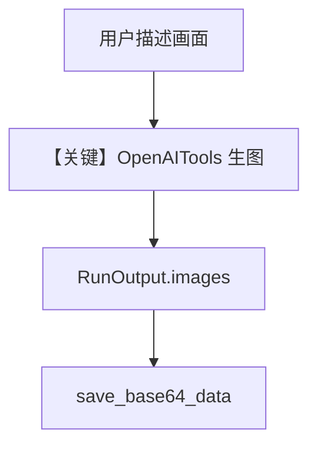

# image_generation_agent.py — 实现原理分析

> 源文件：`cookbook/90_models/openai/responses/image_generation_agent.py`

## 概述

本示例展示 Agno 的 **`OpenAIChat` + `OpenAITools` 图像生成** 机制：通过 Chat Completions 路径调用 `OpenAITools`（含 DALL-E/`gpt-image-1`），并从 `RunOutput.images` 取 Base64 落盘。

**核心配置一览：**

| 配置项 | 值 | 说明 |
|--------|------|------|
| `model` | `OpenAIChat(id="gpt-4o")` | **Chat Completions**，非 Responses |
| `tools` | `[OpenAITools(image_model="gpt-image-1")]` | OpenAI 官方工具包（含生图） |
| `markdown` | `True` | Markdown 附加段 |

## 架构分层

```
用户代码层                agno.agent 层
┌──────────────────┐    ┌──────────────────────────────────┐
│ agent.run(...)   │───>│ 工具调用链 → 生图 → response.images   │
│ OpenAIChat       │    │ chat.completions.create              │
└──────────────────┘    └──────────────────────────────────┘
```

## 核心组件解析

### OpenAITools(image_model=...)

配置图像子模型；Agent 执行后若返回图像，保存在 `response.images`。

### 运行机制与因果链

1. **路径**：用户自然语言 → 模型决定调用生图工具 → 返回含图像内容的 `RunOutput`。
2. **状态**：`save_base64_data` 写本地 `tmp/coffee_shop.png`，无 DB。
3. **分支**：无工具则仅文本；本示例依赖工具分支产出图。
4. **定位**：同目录多数文件用 **Responses**，本文件刻意用 **Chat + OpenAITools** 演示生图。

## System Prompt 组装

无显式 `instructions`/`description`；`markdown=True`。

### 还原后的完整 System 文本

```text
<additional_information>
- Use markdown to format your answers.
</additional_information>

```

## 完整 API 请求

```python
# Chat Completions（OpenAIChat.invoke ~L412）
client.chat.completions.create(
    model="gpt-4o",
    messages=[...],
    tools=[...],  # OpenAITools 展开 schema
)
```

## Mermaid 流程图



## 关键源码文件索引

| 文件 | 关键函数/类 | 作用 |
|------|------------|------|
| `agno/models/openai/chat.py` | `invoke()` L385 | Chat 调用 |
| `agno/tools/openai/` | `OpenAITools` | 生图工具 |
