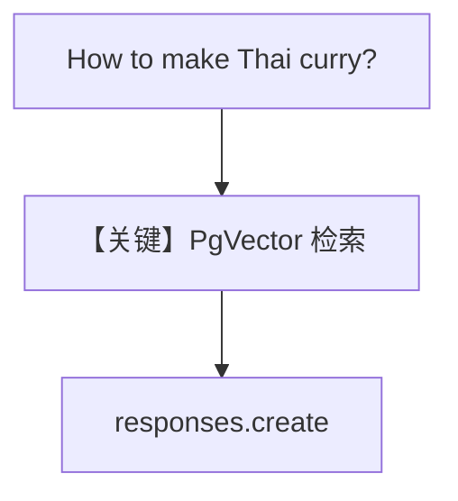

# knowledge.py — 实现原理分析

<!-- cookbook-py-source:start -->
## 完整源码

```python
"""Run `uv pip install ddgs sqlalchemy pgvector pypdf openai` to install dependencies."""

from agno.agent import Agent
from agno.knowledge.knowledge import Knowledge
from agno.models.openai import OpenAIResponses
from agno.vectordb.pgvector import PgVector

# ---------------------------------------------------------------------------
# Create Agent
# ---------------------------------------------------------------------------

db_url = "postgresql+psycopg://ai:ai@localhost:5532/ai"

knowledge = Knowledge(
    vector_db=PgVector(table_name="recipes", db_url=db_url),
)
# Add content to the knowledge
knowledge.insert(url="https://agno-public.s3.amazonaws.com/recipes/ThaiRecipes.pdf")

agent = Agent(model=OpenAIResponses(id="gpt-4o"), knowledge=knowledge)
agent.print_response("How to make Thai curry?", markdown=True)

# ---------------------------------------------------------------------------
# Run Agent
# ---------------------------------------------------------------------------

if __name__ == "__main__":
    pass
```

<!-- cookbook-py-source:end -->

> 源文件：`cookbook/90_models/openai/responses/knowledge.py`

## 概述

本示例展示 Agno 的 **`Knowledge` + `PgVector` + `OpenAIResponses`** 机制：PDF 入库向量库，Agent 在问答时检索相关片段（需 Postgres/pgvector）。

**核心配置一览：**

| 配置项 | 值 | 说明 |
|--------|------|------|
| `model` | `OpenAIResponses(id="gpt-4o")` | Responses |
| `knowledge` | `Knowledge(vector_db=PgVector(...))` | RAG |
| `search_knowledge` | 未在源码显式写出 | 若需 agentic RAG 通常设 `True`（本示例以 `print_response(..., markdown=True)` 调用，请对照当前 Agent 默认） |

## 核心组件解析

### knowledge.insert(url=...)

将远程 PDF 摄入向量表；查询时嵌入检索。

### 运行机制与因果链

1. **路径**：问题 →（若启用）检索 chunks → 注入上下文 → `responses.create`。
2. **状态**：数据在 Postgres；向量表 `recipes`。
3. **分支**：未起 PG 时示例无法跑通。
4. **定位**：OpenAI Responses 与 **知识库** 集成范例。

## System Prompt 组装

依赖框架是否在 context 中附加检索块；**无法仅凭本 20 行静态还原完整 system**。请在 `get_run_messages` 或调试日志中查看检索片段是否进入消息。

## Mermaid 流程图



## 关键源码文件索引

| 文件 | 关键函数/类 | 作用 |
|------|------------|------|
| `agno/knowledge/knowledge.py` | `Knowledge` | RAG 入口 |
| `agno/vectordb/pgvector/` | `PgVector` | 向量存储 |
