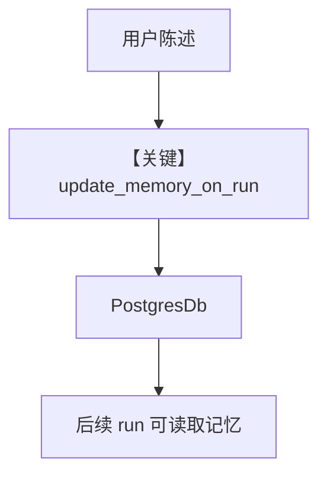

# memory.py — 实现原理分析

> 源文件：`cookbook/90_models/openai/responses/memory.py`

## 概述

本示例展示 Agno 的 **`PostgresDb` + `update_memory_on_run` + `enable_session_summaries`** 机制：在 Responses 模型上持久化用户记忆与会话摘要，并多轮更新。

**核心配置一览：**

| 配置项 | 值 | 说明 |
|--------|------|------|
| `model` | `OpenAIResponses(id="gpt-4o")` | Responses |
| `user_id` | `"test_user"` | 用户维度 |
| `session_id` | `"test_session"` | 会话维度 |
| `db` | `PostgresDb(...)` | 持久化 |
| `update_memory_on_run` | `True` | 运行后更新记忆 |
| `enable_session_summaries` | `True` | 会话摘要 |

## 运行机制与因果链

1. **路径**：每轮 `print_response` 后记忆管理器更新；后续问题可带记忆与摘要进 context。
2. **状态**：**写入** PG；`get_user_memories`/`get_session` 读取演示。
3. **分支**：关闭 `update_memory_on_run` 则不写入长期记忆。
4. **定位**：与 `db.py`（仅历史）相比，本文件强调 **用户记忆 + 摘要**。

## System Prompt 组装

当 `add_memories_to_context` 等开启时，`#3.3.9` 段可能注入 memories（见 `_messages.py`）。本文件未显式设置该项，以运行时为准。

## Mermaid 流程图

## 关键源码文件索引

| 文件 | 关键函数/类 | 作用 |
|------|------------|------|
| `agno/agent/_messages.py` | memories 段 ~L286 起 | 记忆注入 system |
| `agno/db/postgres.py` | `PostgresDb` | 存储 |
