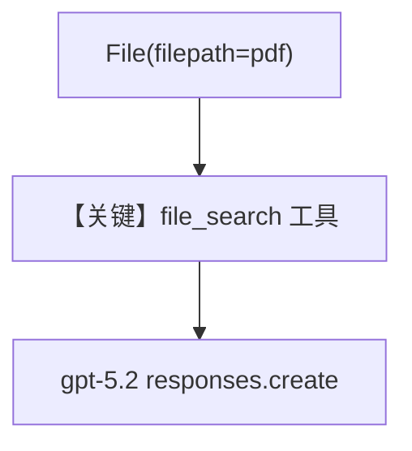

# pdf_input_local.py — 实现原理分析

<!-- cookbook-py-source:start -->
## 完整源码

```python
"""
Openai Pdf Input Local
======================

Cookbook example for `openai/responses/pdf_input_local.py`.
"""

from pathlib import Path

from agno.agent import Agent
from agno.media import File
from agno.models.openai.responses import OpenAIResponses
from agno.utils.media import download_file

# ---------------------------------------------------------------------------
# Create Agent
# ---------------------------------------------------------------------------

pdf_path = Path(__file__).parent.joinpath("ThaiRecipes.pdf")

# Download the file using the download_file function
download_file(
    "https://agno-public.s3.amazonaws.com/recipes/ThaiRecipes.pdf", str(pdf_path)
)

agent = Agent(
    model=OpenAIResponses(id="gpt-5.2"),
    tools=[{"type": "file_search"}],
    markdown=True,
    add_history_to_context=True,
)

agent.print_response(
    "Summarize the contents of the attached file.",
    files=[File(filepath=pdf_path)],
)
agent.print_response("Suggest me a recipe from the attached file.")

# ---------------------------------------------------------------------------
# Run Agent
# ---------------------------------------------------------------------------

if __name__ == "__main__":
    pass
```

<!-- cookbook-py-source:end -->

> 源文件：`cookbook/90_models/openai/responses/pdf_input_local.py`

## 概述

本示例展示 Agno 的 **`file_search` 内置工具 + 本地 PDF`** 机制：`OpenAIResponses` 注册 OpenAI 原生 `file_search`，附件为本地 `File(filepath)`，并开启历史以便第二轮追问食谱。

**核心配置一览：**

| 配置项 | 值 | 说明 |
|--------|------|------|
| `model` | `OpenAIResponses(id="gpt-5.2")` | Responses |
| `tools` | `[{"type": "file_search"}]` | 平台内置文件搜索 |
| `markdown` | `True` | Markdown |
| `add_history_to_context` | `True` | 多轮 |

## 运行机制与因果链

1. **路径**：本地 PDF → `File(filepath)` → 与 `file_search` 协同；第二轮无新文件但依赖历史。
2. **状态**：会话历史；无显式 `db` 时见 Agent 默认 session。
3. **分支**：无 `file_search` 则无法走内置向量检索分支。
4. **定位**：与 `pdf_input_url.py` 对照 **本地路径**。

## System Prompt 组装

### 还原后的完整 System 文本（仅框架默认 + markdown）

```text
<additional_information>
- Use markdown to format your answers.
</additional_information>

```

## Mermaid 流程图



## 关键源码文件索引

| 文件 | 关键函数/类 | 作用 |
|------|------------|------|
| `agno/models/openai/responses.py` | `invoke()` L671 | Responses |
