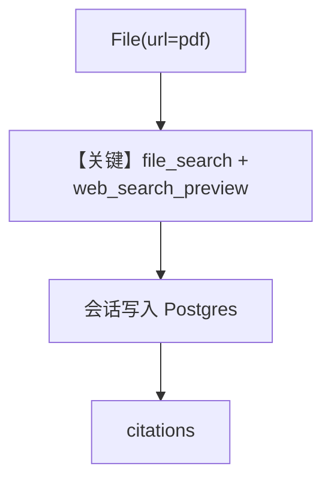

# pdf_input_url.py — 实现原理分析

> 源文件：`cookbook/90_models/openai/responses/pdf_input_url.py`

## 概述

本示例展示 Agno 的 **`PostgresDb` + `file_search` + `web_search_preview`** 机制：远程 PDF 作附件，结合内置文件搜索与联网预览，会话落库并打印 **citations**。

**核心配置一览：**

| 配置项 | 值 | 说明 |
|--------|------|------|
| `model` | `OpenAIResponses(id="gpt-5.2")` | Responses |
| `db` | `PostgresDb(...)` | 会话存储 |
| `tools` | `file_search` + `web_search_preview` | 双内置工具 |
| `markdown` | `True` | Markdown |

## 运行机制与因果链

1. **路径**：`File(url=...pdf)` → 模型检索与联网 → `session.runs[-1].citations` 可追溯引用。
2. **状态**：**写入** `PostgresDb`；citations 在最后一轮 run。
3. **分支**：无 `db` 时可能无法按示例取 session。
4. **定位**：强调 **URL 附件 + 引用输出**。

## Mermaid 流程图

## 关键源码文件索引

| 文件 | 关键函数/类 | 作用 |
|------|------------|------|
| `agno/agent/agent.py` | `get_session()` | 读会话与 citations |
