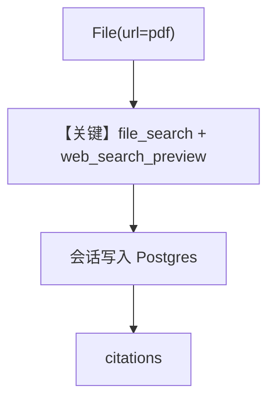

# pdf_input_url.py — 实现原理分析

<!-- cookbook-py-source:start -->
## 完整源码

```python
"""
Openai Pdf Input Url
====================

Cookbook example for `openai/responses/pdf_input_url.py`.
"""

from agno.agent import Agent
from agno.db.postgres import PostgresDb
from agno.media import File
from agno.models.openai.responses import OpenAIResponses

# ---------------------------------------------------------------------------
# Create Agent
# ---------------------------------------------------------------------------

# Setup the database for the Agent Session to be stored
db_url = "postgresql+psycopg://ai:ai@localhost:5532/ai"
db = PostgresDb(db_url=db_url)

agent = Agent(
    model=OpenAIResponses(id="gpt-5.2"),
    db=db,
    tools=[{"type": "file_search"}, {"type": "web_search_preview"}],
    markdown=True,
)

agent.print_response(
    "Summarize the contents of the attached file and search the web for more information.",
    files=[File(url="https://agno-public.s3.amazonaws.com/recipes/ThaiRecipes.pdf")],
)

# Get the stored Agent session, to check the response citations
session = agent.get_session()
if session and session.runs and session.runs[-1].citations:
    print("Citations:")
    print(session.runs[-1].citations)

# ---------------------------------------------------------------------------
# Run Agent
# ---------------------------------------------------------------------------

if __name__ == "__main__":
    pass
```

<!-- cookbook-py-source:end -->

> 源文件：`cookbook/90_models/openai/responses/pdf_input_url.py`

## 概述

本示例展示 Agno 的 **`PostgresDb` + `file_search` + `web_search_preview`** 机制：远程 PDF 作附件，结合内置文件搜索与联网预览，会话落库并打印 **citations**。

**核心配置一览：**

| 配置项 | 值 | 说明 |
|--------|------|------|
| `model` | `OpenAIResponses(id="gpt-5.2")` | Responses |
| `db` | `PostgresDb(...)` | 会话存储 |
| `tools` | `file_search` + `web_search_preview` | 双内置工具 |
| `markdown` | `True` | Markdown |

## 运行机制与因果链

1. **路径**：`File(url=...pdf)` → 模型检索与联网 → `session.runs[-1].citations` 可追溯引用。
2. **状态**：**写入** `PostgresDb`；citations 在最后一轮 run。
3. **分支**：无 `db` 时可能无法按示例取 session。
4. **定位**：强调 **URL 附件 + 引用输出**。

## Mermaid 流程图



## 关键源码文件索引

| 文件 | 关键函数/类 | 作用 |
|------|------------|------|
| `agno/agent/agent.py` | `get_session()` | 读会话与 citations |
