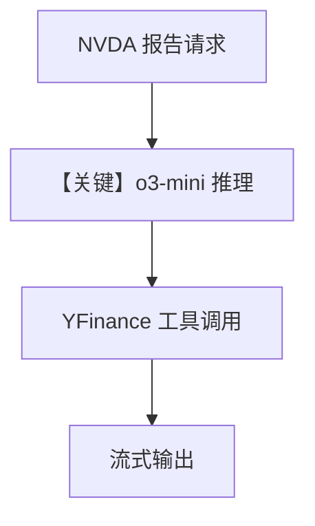

# reasoning_o3_mini.py — 实现原理分析

> 源文件：`cookbook/90_models/openai/responses/reasoning_o3_mini.py`

## 概述

本示例展示 Agno 的 **`o3-mini` 推理模型 + `YFinanceTools`** 机制：利用推理型模型生成投研式报告，工具提供结构化金融数据。

**核心配置一览：**

| 配置项 | 值 | 说明 |
|--------|------|------|
| `model` | `OpenAIResponses(id="o3-mini")` | Responses |
| `tools` | `[YFinanceTools()]` | 金融数据 |
| `markdown` | `True` | Markdown |

## Mermaid 流程图



## System Prompt 组装

### 还原后的完整 System 文本

```text
<additional_information>
- Use markdown to format your answers.
</additional_information>

```

## 关键源码文件索引

| 文件 | 关键函数/类 | 作用 |
|------|------------|------|
| `agno/models/openai/responses.py` | `invoke_stream` | 流式 |
