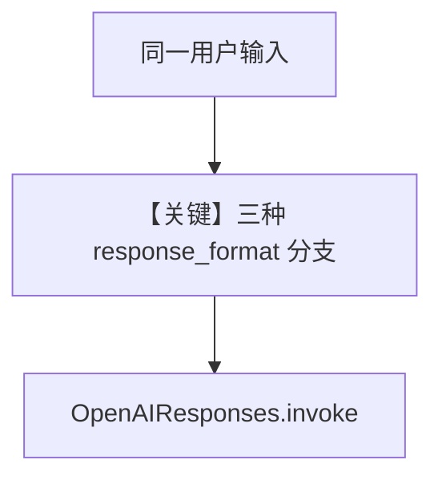

# structured_output.py — 实现原理分析

> 源文件：`cookbook/90_models/openai/responses/structured_output.py`

## 概述

本示例展示 Agno 的 **`output_schema` 三种模式** 机制：同一 `MovieScript` Pydantic 模型下对比 `use_json_mode=True`、默认严格结构化、以及 `strict_output=False`（guided）在 `OpenAIResponses` 上的行为。

**核心配置一览：**

| Agent | 关键参数 | 说明 |
|-------|---------|------|
| `json_mode_agent` | `use_json_mode=True` | JSON mode |
| `structured_output_agent` | 默认 `strict_output` | 结构化输出 |
| `guided_output_agent` | `OpenAIResponses(..., strict_output=False)` | 宽松 guided |

## 核心组件解析

### output_schema=MovieScript

`get_system_message` 中当存在 `output_schema` 时，`markdown` 附加段可能被抑制（`_messages.py` `#3.2.1`：`output_schema is None` 才追加 Markdown 提示）。

### 运行机制与因果链

1. **路径**：`print_response("New York")` 三次 → 三种参数组合 → 不同 `response_format`/请求体。
2. **状态**：三个独立 Agent 实例，无共享 session。
3. **分支**：`use_json_mode` vs 结构化 vs `strict_output=False`。
4. **定位**：**结构化输出矩阵** 最小对比板。

## System Prompt 组装

各 Agent 含 `description="You write movie scripts."`。

### 还原后的完整 System 文本（共性部分）

```text
You write movie scripts.

```

（另含 `expected_output`/schema 相关段由框架根据 `output_schema` 注入，请以运行时为准。）

## Mermaid 流程图



## 关键源码文件索引

| 文件 | 关键函数/类 | 作用 |
|------|------------|------|
| `agno/models/openai/responses.py` | `get_request_params` | response_format |
