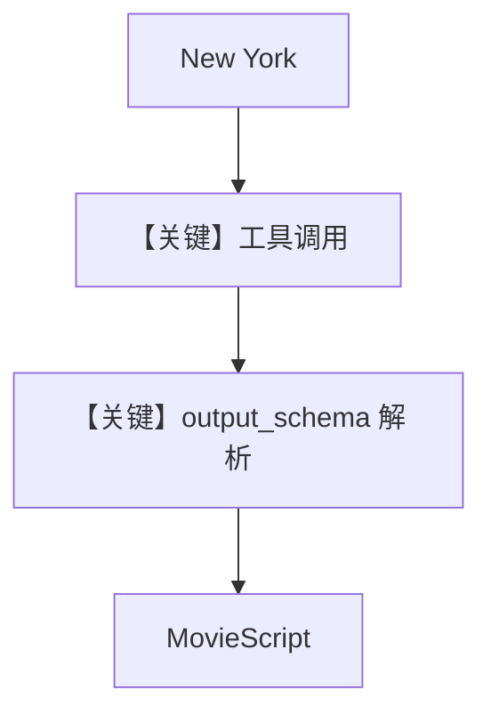

# structured_output_with_tools.py — 实现原理分析

<!-- cookbook-py-source:start -->
## 完整源码

```python
"""
Openai Structured Output With Tools
===================================

Cookbook example for `openai/responses/structured_output_with_tools.py`.
"""

from typing import List

from agno.agent import Agent
from agno.models.openai import OpenAIResponses
from agno.tools.websearch import WebSearchTools
from pydantic import BaseModel, Field

# ---------------------------------------------------------------------------
# Create Agent
# ---------------------------------------------------------------------------


class MovieScript(BaseModel):
    setting: str = Field(
        ..., description="Provide a nice setting for a blockbuster movie."
    )
    ending: str = Field(
        ...,
        description="Ending of the movie. If not available, provide a happy ending.",
    )
    genre: str = Field(
        ...,
        description="Genre of the movie. If not available, select action, thriller or romantic comedy.",
    )
    name: str = Field(..., description="Give a name to this movie")
    characters: List[str] = Field(..., description="Name of characters for this movie.")
    storyline: str = Field(
        ..., description="3 sentence storyline for the movie. Make it exciting!"
    )


structured_output_agent = Agent(
    model=OpenAIResponses(id="gpt-5-mini"),
    tools=[WebSearchTools()],
    instructions="Use the tools to get the information you need. You have access to the DuckDuckGo search tools",
    description="You write movie scripts.",
    output_schema=MovieScript,
)

structured_output_agent.print_response("New York", stream=True)

# ---------------------------------------------------------------------------
# Run Agent
# ---------------------------------------------------------------------------

if __name__ == "__main__":
    pass
```

<!-- cookbook-py-source:end -->

> 源文件：`cookbook/90_models/openai/responses/structured_output_with_tools.py`

## 概述

本示例展示 Agno 的 **`output_schema` + 工具并存** 机制：`gpt-5-mini` 可先 `WebSearchTools` 再输出符合 `MovieScript` 的结构化结果。

**核心配置一览：**

| 配置项 | 值 | 说明 |
|--------|------|------|
| `model` | `OpenAIResponses(id="gpt-5-mini")` | Responses |
| `tools` | `[WebSearchTools()]` | 搜索 |
| `instructions` | 使用 DuckDuckGo 等（源码字符串） | 工具使用提示 |
| `description` | `"You write movie scripts."` | 角色 |
| `output_schema` | `MovieScript` | 结构化输出 |

## System Prompt 组装

### 还原后的完整 System 文本（字面量部分）

```text
You write movie scripts.

Use the tools to get the information you need. You have access to the DuckDuckGo search tools

```

（顺序与标签以 `get_system_message` 实际拼装为准。）

## Mermaid 流程图



## 关键源码文件索引

| 文件 | 关键函数/类 | 作用 |
|------|------------|------|
| `agno/agent/_tools.py` | `get_tools()` | 工具 schema |
