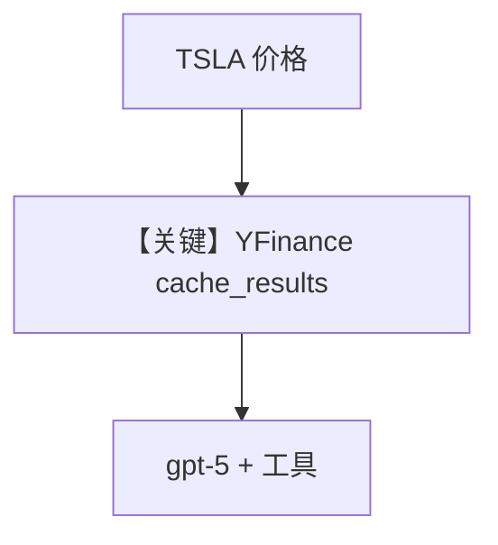

# tool_use_gpt_5.py — 实现原理分析

<!-- cookbook-py-source:start -->
## 完整源码

```python
"""
Openai Tool Use Gpt 5
=====================

Cookbook example for `openai/responses/tool_use_gpt_5.py`.
"""

from agno.agent import Agent
from agno.models.openai import OpenAIResponses
from agno.tools.yfinance import YFinanceTools

# ---------------------------------------------------------------------------
# Create Agent
# ---------------------------------------------------------------------------

agent = Agent(
    model=OpenAIResponses(id="gpt-5"),
    tools=[YFinanceTools(cache_results=True)],
    markdown=True,
    telemetry=False,
)

agent.print_response("What is the current price of TSLA?", stream=True)

# ---------------------------------------------------------------------------
# Run Agent
# ---------------------------------------------------------------------------

if __name__ == "__main__":
    pass
```

<!-- cookbook-py-source:end -->

> 源文件：`cookbook/90_models/openai/responses/tool_use_gpt_5.py`

## 概述

本示例展示 Agno 的 **`gpt-5` + `YFinanceTools(cache_results=True)`** 机制：在 Responses 路径上查询 TSLA 现价，并缓存工具结果；`telemetry=False` 关闭遥测。

**核心配置一览：**

| 配置项 | 值 | 说明 |
|--------|------|------|
| `model` | `OpenAIResponses(id="gpt-5")` | Responses |
| `tools` | `[YFinanceTools(cache_results=True)]` | 缓存行情 |
| `markdown` | `True` | Markdown |
| `telemetry` | `False` | 关闭遥测 |

## Mermaid 流程图



## System Prompt 组装

### 还原后的完整 System 文本

```text
<additional_information>
- Use markdown to format your answers.
</additional_information>

```

## 关键源码文件索引

| 文件 | 关键函数/类 | 作用 |
|------|------------|------|
| `agno/tools/yfinance/` | `YFinanceTools` | 行情工具 |
