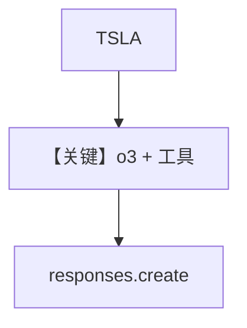

# tool_use_o3.py — 实现原理分析

> 源文件：`cookbook/90_models/openai/responses/tool_use_o3.py`

## 概述

本示例展示 Agno 的 **`o3` 模型 + YFinance** 机制：与 `tool_use_gpt_5.py` 同构，仅模型 id 换为 `o3`，演示推理系列模型上的工具调用。

**核心配置一览：**

| 配置项 | 值 | 说明 |
|--------|------|------|
| `model` | `OpenAIResponses(id="o3")` | Responses |
| `tools` | `[YFinanceTools(cache_results=True)]` | 行情 |
| `telemetry` | `False` | 关闭遥测 |

## Mermaid 流程图



## System Prompt 组装

### 还原后的完整 System 文本

```text
<additional_information>
- Use markdown to format your answers.
</additional_information>

```

## 关键源码文件索引

| 文件 | 关键函数/类 | 作用 |
|------|------------|------|
| `agno/models/openai/responses.py` | `invoke()` L671 | Responses |
