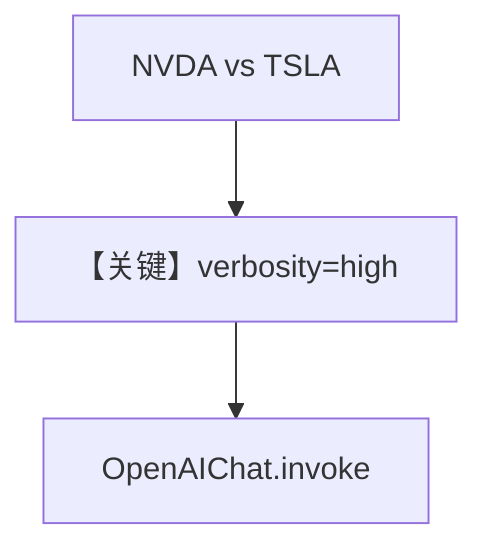

# verbosity_control.py — 实现原理分析

> 源文件：`cookbook/90_models/openai/responses/verbosity_control.py`

## 概述

本示例展示 Agno 的 **`OpenAIChat` + `verbosity`** 在 **responses 目录下仍走 Chat Completions** 的机制：与 `openai/chat/verbosity_control.py` 同构，用 `gpt-5` 与 `YFinanceTools` 生成表格化报告。

**核心配置一览：**

| 配置项 | 值 | 说明 |
|--------|------|------|
| `model` | `OpenAIChat(id="gpt-5", verbosity="high")` | **Chat Completions**（非 OpenAIResponses） |
| `tools` | `[YFinanceTools()]` | 金融工具 |
| `instructions` | `"Use tables to display data."` | 表格指令 |
| `markdown` | `True` | Markdown 附加段 |

## 完整 API 请求

使用 `chat.completions.create`，而非 `responses.create`（见 `agno/models/openai/chat.py` `invoke` ~L412）。

## Mermaid 流程图



## System Prompt 组装

### 还原后的完整 System 文本

```text
Use tables to display data.


<additional_information>
- Use markdown to format your answers.
</additional_information>

```

## 关键源码文件索引

| 文件 | 关键函数/类 | 作用 |
|------|------------|------|
| `agno/models/openai/chat.py` | `invoke()` L385 | Chat |
