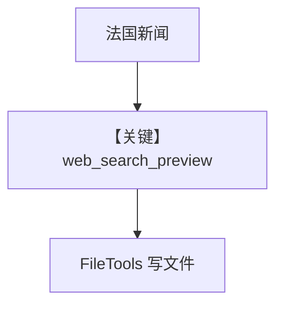

# websearch_builtin_tool.py — 实现原理分析

> 源文件：`cookbook/90_models/openai/responses/websearch_builtin_tool.py`

## 概述

本示例展示 Agno 的 **OpenAI 原生 `web_search_preview` + `FileTools`** 机制：混合字典形式内置工具与 Agno `FileTools`，并把搜索结果写入文件。

**核心配置一览：**

| 配置项 | 值 | 说明 |
|--------|------|------|
| `model` | `OpenAIResponses(id="gpt-4o")` | Responses |
| `tools` | `[{"type": "web_search_preview"}, FileTools()]` | 内置 + 封装工具 |
| `instructions` | `"Save the results to a file with a relevant name."` | 保存文件 |
| `markdown` | `True` | Markdown |

## System Prompt 组装

### 还原后的完整 System 文本（字面量）

```text
Save the results to a file with a relevant name.


<additional_information>
- Use markdown to format your answers.
</additional_information>

```

## Mermaid 流程图



## 关键源码文件索引

| 文件 | 关键函数/类 | 作用 |
|------|------------|------|
| `agno/tools/file/` | `FileTools` | 本地文件操作 |
