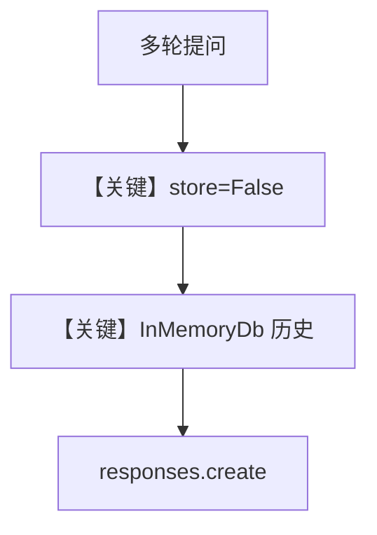

# zdr_reasoning_agent.py — 实现原理分析

> 源文件：`cookbook/90_models/openai/responses/zdr_reasoning_agent.py`

## 概述

本示例展示 Agno 的 **`OpenAIResponses` + ZDR（Zero Data Retention）+ 推理摘要** 机制：`store=False` 避免服务端保留，`reasoning_summary="auto"` 请求推理摘要；`InMemoryDb` + `add_history_to_context` 在客户端侧维持多轮。

**核心配置一览：**

| 配置项 | 值 | 说明 |
|--------|------|------|
| `name` | `"ZDR Compliant Agent"` | Agent 名称 |
| `session_id` | `"zdr_demo_session"` | 会话 id |
| `model` | `OpenAIResponses(id="o4-mini", store=False, reasoning_summary="auto")` | Responses；ZDR + 推理摘要 |
| `instructions` | `"You are a helpful AI assistant operating in Zero Data Retention mode..."` | ZDR 说明 |
| `db` | `InMemoryDb()` | 内存会话 |
| `add_history_to_context` | `True` | 历史 |
| `stream` | `True` | Agent 级默认流式（若适用） |

## 运行机制与因果链

1. **路径**：三轮地理/人口问题 → 历史在 **InMemoryDb** 中；OpenAI 侧 `store=False` 降低数据驻留。
2. **状态**：客户端 session；**不**依赖 OpenAI 长期存储。
3. **分支**：`store=True` 时提供商可能保留（与 ZDR 目标冲突）。
4. **定位**：**合规/隐私** 与 **o4-mini 推理摘要** 组合示例。

## System Prompt 组装

### 还原后的完整 System 文本（instructions 原样）

```text
You are a helpful AI assistant operating in Zero Data Retention mode for maximum privacy and compliance.
```

（若含 name 上下文等，见 `add_name_to_context`；本文件未设置 `add_name_to_context`。）

## 完整 API 请求

```python
client.responses.create(
    model="o4-mini",
    input=[...],
    store=False,
    reasoning={"summary": "auto"},  # 以实际 get_request_params 字段为准
)
```

## Mermaid 流程图



## 关键源码文件索引

| 文件 | 关键函数/类 | 作用 |
|------|------------|------|
| `agno/models/openai/responses.py` | `get_request_params` | store / reasoning |
| `agno/db/in_memory.py` | `InMemoryDb` | 内存会话 |
