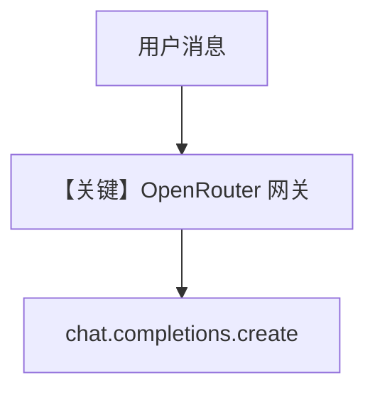

# basic.py — 实现原理分析

<!-- cookbook-py-source:start -->
## 完整源码

```python
"""
Openrouter Basic
================

Cookbook example for `openrouter/chat/basic.py`.
"""

from agno.agent import Agent, RunOutput  # noqa
from agno.models.openrouter import OpenRouter
import asyncio

# ---------------------------------------------------------------------------
# Create Agent
# ---------------------------------------------------------------------------

agent = Agent(model=OpenRouter(id="gpt-4o"), markdown=True)

# Get the response in a variable
# run: RunOutput = agent.run("Share a 2 sentence horror story")
# print(run.content)

# Print the response in the terminal

# ---------------------------------------------------------------------------
# Run Agent
# ---------------------------------------------------------------------------
if __name__ == "__main__":
    # --- Sync ---
    agent.print_response("Share a 2 sentence horror story")

    # --- Sync + Streaming ---
    agent.print_response("Share a 2 sentence horror story", stream=True)

    # --- Async ---
    asyncio.run(agent.aprint_response("Share a 2 sentence horror story"))

    # --- Async + Streaming ---
    asyncio.run(agent.aprint_response("Share a 2 sentence horror story", stream=True))
```

<!-- cookbook-py-source:end -->

> 源文件：`cookbook/90_models/openrouter/chat/basic.md`

## 概述

本示例展示 Agno 的 **`OpenRouter`（OpenAILike）** 机制：经 OpenRouter 统一网关调用 `gpt-4o`，演示同步/流式/异步四种用法。

**核心配置一览：**

| 配置项 | 值 | 说明 |
|--------|------|------|
| `model` | `OpenRouter(id="gpt-4o")` | Chat Completions 兼容，`base_url` 默认 `https://openrouter.ai/api/v1` |
| `markdown` | `True` | Markdown 附加段 |

## 完整 API 请求

底层为 `chat.completions.create`（见 `OpenAILike`/`OpenAIChat` 系 `invoke`，OpenRouter 继承 `OpenAILike`）。

```python
# 等价形态（经 OpenRouter 客户端）
client.chat.completions.create(
    model="gpt-4o",
    messages=[...],
    extra_headers={"HTTP-Referer": ...},  # 以 OpenRouter 要求为准
)
```

## Mermaid 流程图



## System Prompt 组装

### 还原后的完整 System 文本

```text
<additional_information>
- Use markdown to format your answers.
</additional_information>

```

## 关键源码文件索引

| 文件 | 关键函数/类 | 作用 |
|------|------------|------|
| `agno/models/openrouter/openrouter.py` | `OpenRouter` L16 | 网关与 `OPENROUTER_API_KEY` |
| `agno/models/openai/like.py` | `OpenAILike` | 共用 invoke 形态 |
