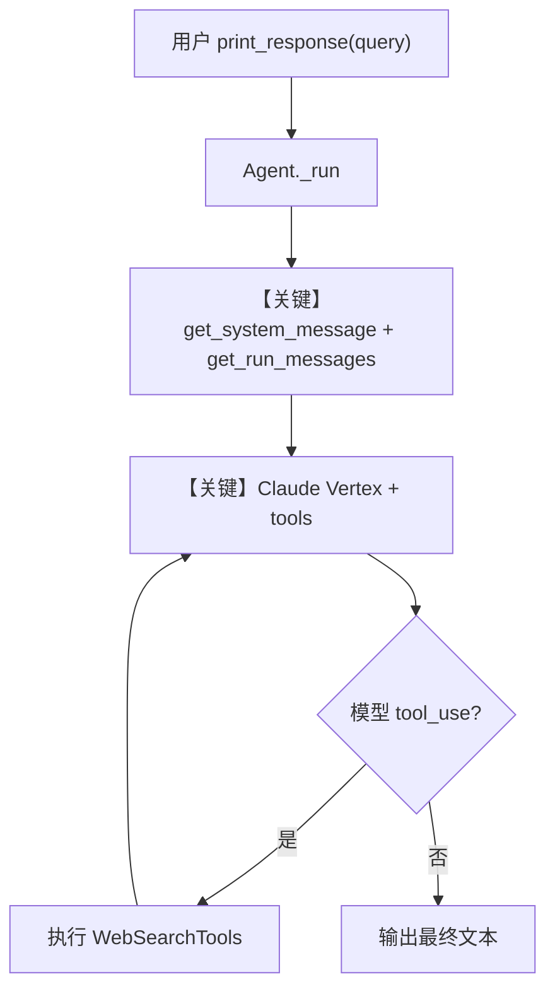

# tool_use.py — 实现原理分析

> 源文件：`cookbook/90_models/vertexai/claude/tool_use.py`

## 概述

本示例展示 Agno 在 **Vertex AI Claude** 上挂载 **WebSearchTools** 的 **工具调用（tool use）** 流程：通过 Anthropic Messages API 将搜索工具 schema 交给模型，由模型决定是否发起搜索并汇总答案。

**核心配置一览：**

| 配置项 | 值 | 说明 |
|--------|------|------|
| `model` | `Claude(id="claude-sonnet-4@20250514")` | Vertex AI 上的 Claude；Messages API |
| `tools` | `[WebSearchTools()]` | 网页搜索工具 |
| `markdown` | `True` | 在 system 中追加「使用 markdown 格式化」 |
| `name` | `None` | 未设置 |
| `instructions` | `None` | 未设置 |
| `description` | `None` | 未设置 |
| `db` | `None` | 未设置 |

## 架构分层

```
用户代码层                agno.agent 层
┌──────────────────┐    ┌──────────────────────────────────┐
│ tool_use.py      │    │ Agent.print_response / _run()     │
│ Claude + WebSearch│───>│ get_system_message()              │
│                  │    │ get_run_messages() + tools        │
│                  │    │  → Anthropic 适配器 + tool defs   │
└──────────────────┘    └──────────────────────────────────┘
                                │
                                ▼
                        ┌──────────────────┐
                        │ Claude (Vertex)  │
                        │ claude-sonnet-4@ │
                        └──────────────────┘
```

## 核心组件解析

### Vertex AI Claude 模型

`Claude` 继承 Anthropic 系实现，通过 Vertex 凭证与 `AnthropicVertex` 客户端调用 Messages API（见 `agno/models/vertexai/claude.py`）。

### WebSearchTools

`WebSearchTools` 注册为可调用工具；`get_tools()` 将工具定义注入请求，模型可在多轮中返回 `tool_use` 块并由运行时执行。

### 运行机制与因果链

1. **数据路径**：用户字符串 → `print_response` → `Agent._run` → `get_run_messages`（system + user）→ 模型适配器附带 `tools` → 若模型发起工具调用则执行工具 → 结果写回 assistant/tool 消息链直至最终文本。
2. **副作用**：默认无 `db`；无持久会话除非另行配置。
3. **分支**：`stream=True` 时走流式响应；否则一次性 completion。
4. **定位**：本文件是 Vertex Claude 目录下「联网搜索」最小示例，强调 **tools + 同步/异步打印** 三种调用方式。

## System Prompt 组装

| 序号 | 组成部分 | 本文件中的值/来源 | 是否生效 |
|------|---------|-----------------|---------|
| 1 | `description` | 无 | 否 |
| 2 | `role` | 无 | 否 |
| 3 | `instructions` | 无 | 否 |
| 4.1 | `markdown` | `True` | 是（追加 markdown 说明，见 `_messages.py` #3.2.1） |
| 其余 | 工具说明等 | 由 Agent 注入 `_tool_instructions`（若有） | 视工具而定 |

### 拼装顺序与源码锚点

默认路径：`get_system_message()`（`agno/agent/_messages.py`）在 `system_message is None` 且 `build_context=True` 时，按 `# 3.1` instructions → `# 3.1.1` 模型附加说明 → `# 3.2.1` markdown 附加段 → `# 3.3` 描述/角色/指令 → `# 3.3.5` 工具说明等组装。

### 还原后的完整 System 文本

```text
Use markdown to format your answers.

（若运行时注入了 WebSearch 等工具说明，会出现在后续段落；具体以一次 run 内 get_system_message 返回值为准。）
```

本示例未设置 `description`/`instructions`，故主体为 markdown 附加句 + 工具相关说明（由框架与工具类生成）。

### 段落释义（模型视角）

- **Markdown 句**：约束回答使用 Markdown，便于终端渲染。
- **工具段（若存在）**：告知可调用的搜索工具及用法。

### 与 User 消息的边界

用户消息为 `"Whats happening in France?"` 等；system 负责能力与格式，user 负责任务与语境。

## 完整 API 请求

本示例使用 **Anthropic Messages**（经 Vertex），而非 OpenAI `chat.completions`。形态上为 `messages` 列表 + `tools` 定义；流式时开启 stream。

```python
# 概念上等价：Vertex Claude + tools（具体参数以 agno/models/anthropic 与 Vertex 封装为准）
# messages: [system?, user...], tools: OpenAPI-style tool defs from WebSearchTools
```

> 与上一节 system 文本一致：system 侧为拼装结果；user 为自然语言提问。

## Mermaid 流程图



- **【关键】get_system_message + get_run_messages**：组装含工具能力的上下文。
- **【关键】Claude Vertex + tools**：演示工具调用闭环。

## 关键源码文件索引

| 文件 | 关键函数/类 | 作用 |
|------|------------|------|
| `agno/agent/_messages.py` | `get_system_message()` L106+ | 默认 system 拼装 |
| `agno/agent/agent.py` | `Agent._run` | 单次运行入口 |
| `agno/models/vertexai/claude.py` | `Claude` | Vertex Claude 客户端与调用 |
| `agno/tools/websearch/` | `WebSearchTools` | 搜索工具定义与执行 |
