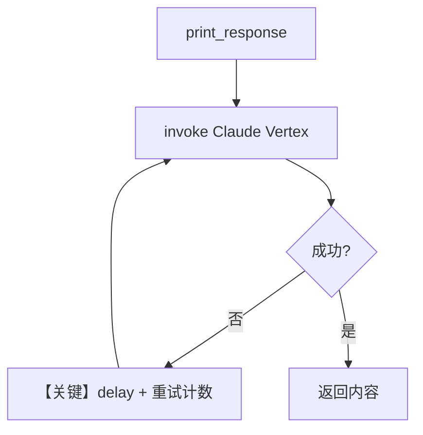

# retry.py — 实现原理分析

> 源文件：`cookbook/90_models/vertexai/retry.py`

## 概述

本示例展示 Agno 在 **Vertex AI Claude** 模型上的 **请求重试（retries / backoff）** 配置：故意使用错误 `id` 触发失败，由模型层按次数与指数退避重试。

**核心配置一览：**

| 配置项 | 值 | 说明 |
|--------|------|------|
| `model` | `Claude(id=wrong_model_id, retries=3, delay_between_retries=1, exponential_backoff=True)` | Vertex Claude + 重试策略 |
| `name` | `None` | 未设置 |
| `instructions` | `None` | 未设置 |
| `markdown` | `None` | 未设置 |
| `tools` | `None` | 未设置 |

## 架构分层

```
用户代码层                agno.agent 层
┌──────────────────┐    ┌──────────────────────────────────┐
│ retry.py         │    │ Agent.print_response              │
│ wrong model id   │───>│ Model 层 invoke 失败 → 重试循环    │
└──────────────────┘    └──────────────────────────────────┘
                                │
                                ▼
                        ┌──────────────────┐
                        │ Claude (Vertex)  │
                        └──────────────────┘
```

## 核心组件解析

### 重试参数

`retries`、`delay_between_retries`、`exponential_backoff` 在 **Model** 基类/Anthropic 适配路径中用于包装 API 调用；错误模型 ID 会在每次尝试失败时触发重试直至上限。

### 运行机制与因果链

1. **数据路径**：用户问题 → `print_response` → 底层请求 Vertex → 因 ID 非法失败 → 等待 → 重试。
2. **副作用**：无 db；仅日志与网络重试。
3. **分支**：`exponential_backoff=True` 时延迟倍增；为 `False` 则固定间隔（以框架实现为准）。
4. **定位**：与 vLLM/xAI 的 retry 示例同主题，仅模型提供商不同。

## System Prompt 组装

未设置 `description`/`instructions`/`markdown`；若默认 `build_context=True`，则仅有默认拼装中可能存在的空 instructions 与模型附加段。可选用 `get_system_message()` 断点查看实际字符串。

### 还原后的完整 System 文本

无法仅从本文件静态确定完整正文（无显式 `instructions`；是否仅有模型默认句取决于 Agent 默认值）。验证：在 `get_system_message()` 返回前打印 `message.content`。

## 完整 API 请求

失败重试发生在 **HTTP/Messages 调用层**；单次请求形态与正常 Claude Vertex 调用相同，区别在失败后会按策略重复发起。

## Mermaid 流程图



## 关键源码文件索引

| 文件 | 关键函数/类 | 作用 |
|------|------------|------|
| `agno/models/base.py` 或各模型 `invoke` | 重试循环 | 失败重试与退避 |
| `agno/agent/agent.py` | `print_response` | 用户入口 |
| `agno/models/vertexai/claude.py` | `Claude` | Vertex 请求 |
