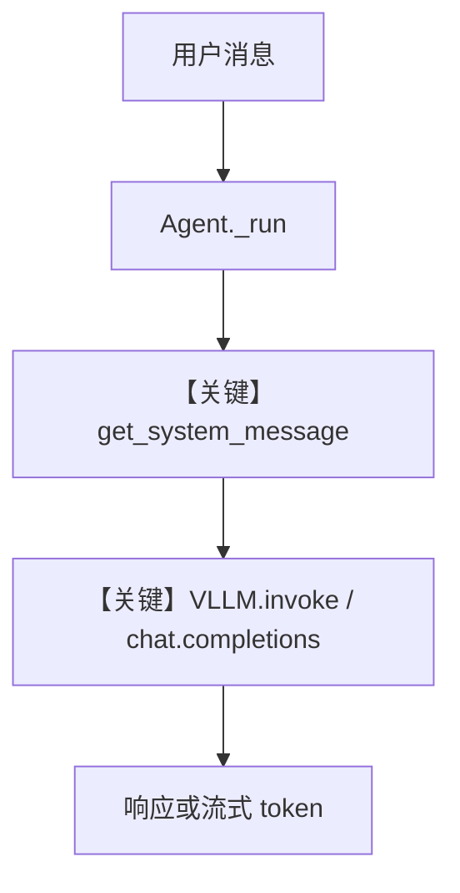

# basic.py — 实现原理分析

<!-- cookbook-py-source:start -->
## 完整源码

```python
"""
Vllm Basic
==========

Cookbook example for `vllm/basic.py`.
"""

import asyncio

from agno.agent import Agent
from agno.models.vllm import VLLM

# ---------------------------------------------------------------------------
# Create Agent
# ---------------------------------------------------------------------------

agent = Agent(
    model=VLLM(id="Qwen/Qwen2.5-7B-Instruct", top_k=20, enable_thinking=False),
    markdown=True,
)

# ---------------------------------------------------------------------------
# Run Agent
# ---------------------------------------------------------------------------
if __name__ == "__main__":
    # --- Sync ---
    agent.print_response("Share a 2 sentence horror story")

    # --- Sync + Streaming ---
    agent.print_response("Share a 2 sentence horror story", stream=True)

    # --- Async ---
    asyncio.run(agent.aprint_response("Share a 2 sentence horror story"))

    # --- Async + Streaming ---
    asyncio.run(agent.aprint_response("Share a 2 sentence horror story", stream=True))
```

<!-- cookbook-py-source:end -->

> 源文件：`cookbook/90_models/vllm/basic.py`

## 概述

本示例展示 Agno 通过 **OpenAI 兼容客户端** 连接本地或远程 **vLLM** 服务（`VLLM` 继承 `OpenAILike`），并演示 **同步 / 流式 / 异步** 四种 `print_response` 用法。

**核心配置一览：**

| 配置项 | 值 | 说明 |
|--------|------|------|
| `model` | `VLLM(id="Qwen/Qwen2.5-7B-Instruct", top_k=20, enable_thinking=False)` | Chat Completions 兼容 API |
| `markdown` | `True` | system 附加 markdown 提示 |
| `name` | `None` | 未设置 |
| `instructions` | `None` | 未设置 |
| `db` | `None` | 未设置 |

## 架构分层

```
用户代码层                agno.agent 层
┌──────────────────┐    ┌──────────────────────────────────┐
│ basic.py         │    │ print_response / aprint_response  │
│ VLLM top_k...    │───>│ get_system_message()               │
│                  │    │ get_run_messages()                 │
└──────────────────┘    └──────────────────────────────────┘
                                │
                                ▼
                        ┌──────────────────┐
                        │ VLLM (OpenAILike) │
                        │ chat.completions  │
                        └──────────────────┘
```

## 核心组件解析

### VLLM 与 extra_body

`VLLM.get_request_params`（`agno/models/vllm/vllm.py`）将 `top_k`、`enable_thinking` 写入 `extra_body`，供 vLLM 服务端解析。

### 运行机制与因果链

1. **路径**：用户句 → `_run` → `OpenAI` 客户端 `chat.completions.create`（默认 `VLLM_BASE_URL`）→ 返回文本。
2. **副作用**：无持久化。
3. **分支**：`stream=True` 走流式 chunk；`asyncio.run(aprint_response)` 走异步客户端。
4. **定位**：vLLM 目录最简「单 Agent + 本地模型」示例。

## System Prompt 组装

| 组成部分 | 生效 |
|----------|------|
| `markdown=True` | 是（`Use markdown to format your answers.`） |
| `instructions` | 否 |

### 还原后的完整 System 文本

```text
Use markdown to format your answers.
```

### 段落释义

- 要求模型用 Markdown 输出，便于终端阅读。

## 完整 API 请求

```python
# VLLM → OpenAI 兼容：chat.completions.create
client.chat.completions.create(
    model="Qwen/Qwen2.5-7B-Instruct",
    messages=[
        {"role": "system", "content": "<见上一节>"},
        {"role": "user", "content": "Share a 2 sentence horror story"},
    ],
    stream=False,  # 或 True
    extra_body={"top_k": 20, "chat_template_kwargs": {"enable_thinking": False}},
)
```

## Mermaid 流程图



## 关键源码文件索引

| 文件 | 关键函数/类 | 作用 |
|------|------------|------|
| `agno/models/vllm/vllm.py` | `VLLM`, `get_request_params` L60+ | extra_body |
| `agno/models/openai/chat.py` | `chat.completions.create` | 实际 HTTP 调用 |
| `agno/agent/_messages.py` | `get_system_message` L106+ | system 拼装 |
