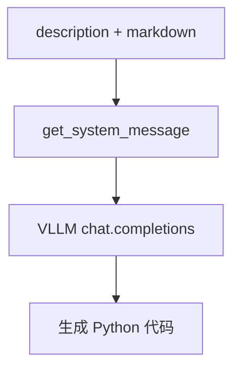

# code_generation.py — 实现原理分析

> 源文件：`cookbook/90_models/vllm/code_generation.py`

## 概述

本示例用 **vLLM** 加载 **DeepSeek-Coder** 类模型，通过 Agent 的 **`description`** 设定「Python 专家」角色，演示 **代码生成** 类提示（Fibonacci DP）。

**核心配置一览：**

| 配置项 | 值 | 说明 |
|--------|------|------|
| `model` | `VLLM(id="deepseek-ai/deepseek-coder-6.7b-instruct")` | OpenAI 兼容 Chat |
| `description` | `"You are an expert Python developer."` | 写入 system 前部（#3.3.1） |
| `markdown` | `True` | 附加 markdown 说明 |
| `instructions` | `None` | 未设置 |

## 架构分层

与 `basic.py` 相同：用户层 → `get_system_message`（含 `description`）→ `VLLM` → `chat.completions`。

## 核心组件解析

### description 进入 system

`agent.description` 在 `_messages.py` `# 3.3.1` 最先拼入 `system_message_content`。

### 运行机制与因果链

1. **路径**：用户请求生成函数 → system 含角色 + markdown 句 → 模型生成代码。
2. **副作用**：无。
3. **分支**：无工具，纯文本补全。
4. **定位**：在 `basic.py` 上增加 **description**，突出代码助手人设。

## System Prompt 组装

### 还原后的完整 System 文本

```text
You are an expert Python developer.

Use markdown to format your answers.
```

（若 `use_instruction_tags` 等为默认，则 instructions 段可能以列表或纯文本形式出现；本示例无 `instructions`。）

## 完整 API 请求

与 `basic.py` 相同形态；`messages[-1].content` 为 Fibonacci 任务字符串。

## Mermaid 流程图



## 关键源码文件索引

| 文件 | 关键函数/类 | 作用 |
|------|------------|------|
| `agno/agent/_messages.py` | `# 3.3.1` description | 角色前缀 |
| `agno/models/vllm/vllm.py` | `VLLM` | vLLM 请求参数 |
