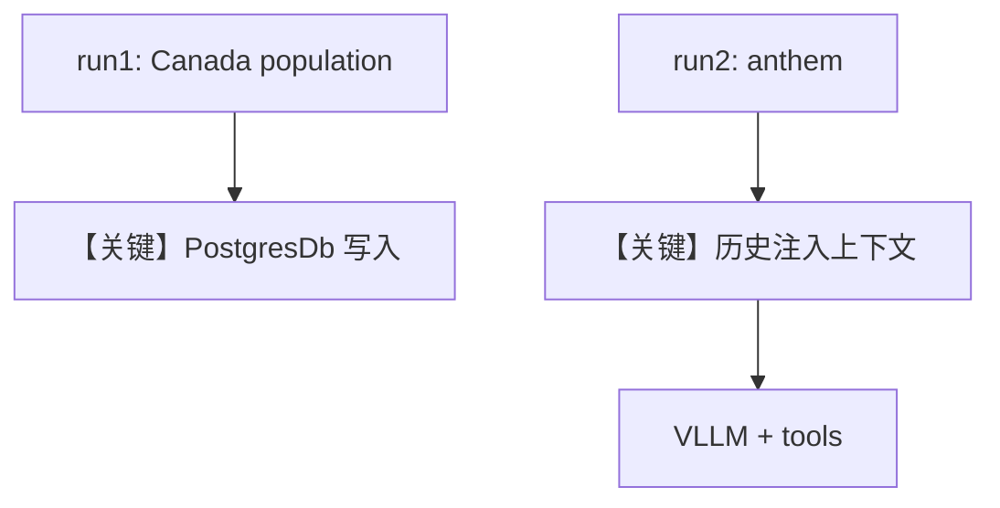

# db.py — 实现原理分析

<!-- cookbook-py-source:start -->
## 完整源码

```python
"""Run `uv pip install sqlalchemy` and ensure Postgres is running (`./cookbook/scripts/run_pgvector.sh`)."""

from agno.agent import Agent
from agno.db.postgres import PostgresDb
from agno.models.vllm import VLLM
from agno.tools.websearch import WebSearchTools

# ---------------------------------------------------------------------------
# Create Agent
# ---------------------------------------------------------------------------

# Setup the database
db_url = "postgresql+psycopg://ai:ai@localhost:5532/ai"
db = PostgresDb(db_url=db_url)

agent = Agent(
    model=VLLM(id="Qwen/Qwen2.5-7B-Instruct"),
    db=db,
    tools=[WebSearchTools()],
    add_history_to_context=True,
)

agent.print_response("How many people live in Canada?")
agent.print_response("What is their national anthem called?")

# ---------------------------------------------------------------------------
# Run Agent
# ---------------------------------------------------------------------------

if __name__ == "__main__":
    pass
```

<!-- cookbook-py-source:end -->

> 源文件：`cookbook/90_models/vllm/db.py`

## 概述

本示例展示 **PostgresDb** 持久化会话 + **add_history_to_context**：第二轮用户问题可依赖第一轮对话中的实体（加拿大人口 → 国歌名称），由 **vLLM** 推理。

**核心配置一览：**

| 配置项 | 值 | 说明 |
|--------|------|------|
| `model` | `VLLM(id="Qwen/Qwen2.5-7B-Instruct")` | Chat Completions |
| `db` | `PostgresDb(db_url=...)` | 会话与消息落库 |
| `tools` | `[WebSearchTools()]` | 可联网查加拿大人口等 |
| `add_history_to_context` | `True` | 将历史 run 注入上下文 |
| `markdown` | `None` | 未设置 |
| `instructions` | `None` | 未设置 |

## 架构分层

```
用户代码层                agno.agent 层
┌──────────────────┐    ┌──────────────────────────────────┐
│ db.py            │    │ run 1 → 存会话                   │
│ Postgres + 历史  │───>│ run 2 → get_run_messages 含历史   │
│ WebSearch        │    │ + tools                          │
└──────────────────┘    └──────────────────────────────────┘
```

## 核心组件解析

### PostgresDb

`PostgresDb` 提供会话存储；`add_history_to_context=True` 时，`get_run_messages` 会拉取近期消息拼入多轮对话。

### WebSearchTools

第一轮问题可能触发搜索以获取人口数；第二轮依赖历史指代「their」。

### 运行机制与因果链

1. **路径**：两次 `print_response` 共享 `session_id`（默认）→ 历史进入后续请求。
2. **副作用**：**写入 PostgreSQL**（消息、运行记录）；需本地 `./cookbook/scripts/run_pgvector.sh` 类环境。
3. **分支**：模型可选择调用搜索工具或仅凭预训练知识。
4. **定位**：vLLM + **生产型 DB** 与 **对话历史** 的组合示例。

## System Prompt 组装

未设 `markdown`/`instructions`；若有工具，则含工具说明段（`_tool_instructions`）。可用断点查看完整 system。

### 还原后的完整 System 文本

无法静态完整还原（取决于工具注入与默认段）。至少包含：模型 `get_instructions_for_model` 可能返回的段 + 工具说明（若启用）。

## 完整 API 请求

第二次调用等价于 `chat.completions.create`，`messages` 含 **历史 assistant/user** + 新 user 消息 + system；`tools` 为 WebSearch 定义。

## Mermaid 流程图



## 关键源码文件索引

| 文件 | 关键函数/类 | 作用 |
|------|------------|------|
| `agno/db/postgres.py` | `PostgresDb` | 持久化 |
| `agno/agent/_messages.py` | `get_run_messages` | 历史与消息列表 |
