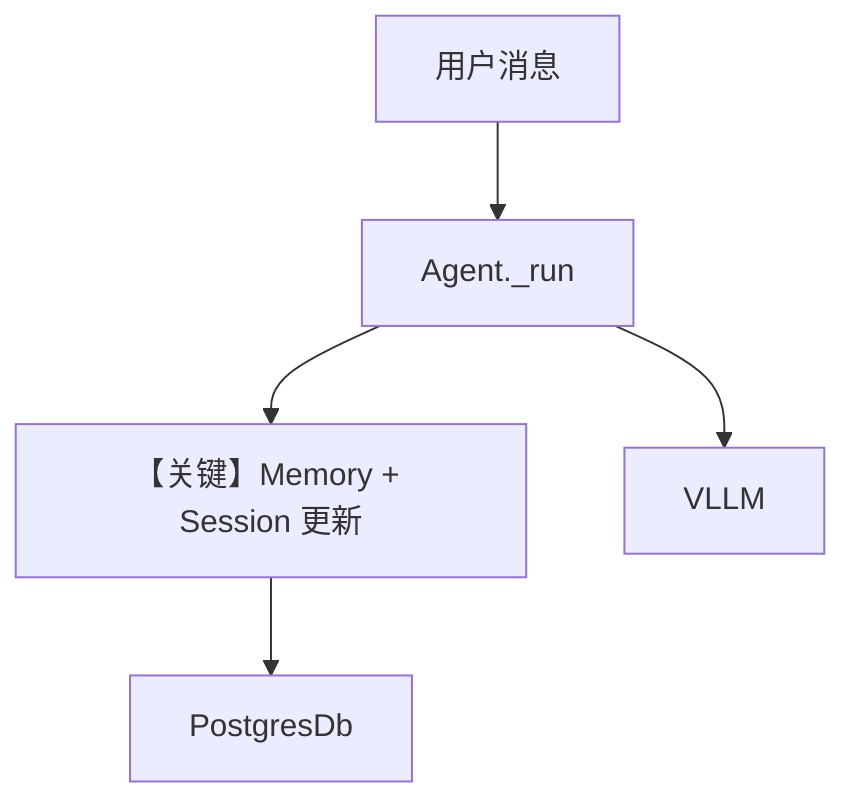

# memory.py — 实现原理分析

> 源文件：`cookbook/90_models/vllm/memory.py`

## 概述

本示例演示 **update_memory_on_run**、**enable_session_summaries** 与 **PostgresDb**：在 vLLM（Phi-3）对话中积累 **用户记忆** 与 **会话摘要**，并打印 `get_user_memories` / `session.summary`。

**核心配置一览：**

| 配置项 | 值 | 说明 |
|--------|------|------|
| `model` | `VLLM(id="microsoft/Phi-3-mini-128k-instruct")` | vLLM 服务 |
| `db` | `PostgresDb(db_url=DB_URL)` | 记忆与摘要存储 |
| `update_memory_on_run` | `True` | 每轮更新记忆 |
| `enable_session_summaries` | `True` | 生成会话摘要 |
| `markdown` | `None` | 未设置 |

## 架构分层

用户层 → Agent 多轮 `print_response` → Memory 管理器写入 DB → 后续轮次 system 可注入记忆（由框架逻辑决定）→ vLLM 生成回复。

## 核心组件解析

### 记忆与摘要

`update_memory_on_run` 触发从对话抽取事实；`enable_session_summaries` 维护 rolling summary。脚本末尾用 `user_id="test_user"`、`session_id="test_session"` 读取（需与 Agent 实际 session 一致方可命中，否则演示的是 API 用法）。

### 运行机制与因果链

1. **路径**：用户陈述 → run → 记忆/摘要管线 → DB。
2. **副作用**：**强副作用**：PostgreSQL 写入、记忆表更新。
3. **分支**：`stream=True` 仅影响输出方式，不改变记忆写入触发（以框架为准）。
4. **定位**：在 `db.py` 之上强调 **Memory + Session Summary**。

## System Prompt 组装

含动态记忆注入时，无法在文档中静态写死全文；需在 `get_system_message` 或等价路径打印。表格略；说明「记忆启用时 system 含记忆片段」。

### 还原后的完整 System 文本

依赖运行时记忆内容，**无法静态还原**；验证：在 run 前后打印 `get_system_message` 返回。

## 完整 API 请求

与标准 vLLM Chat 相同；记忆不直接出现在 OpenAI `messages` 的 user 字段，而经 Agno 拼入 system 或单独段落。

## Mermaid 流程图

## 关键源码文件索引

| 文件 | 关键函数/类 | 作用 |
|------|------------|------|
| `agno/memory/` | Memory 管线 | 记忆抽取与注入 |
| `agno/agent/_messages.py` | `add_memories_to_context` 等 | system 中的记忆段 |
