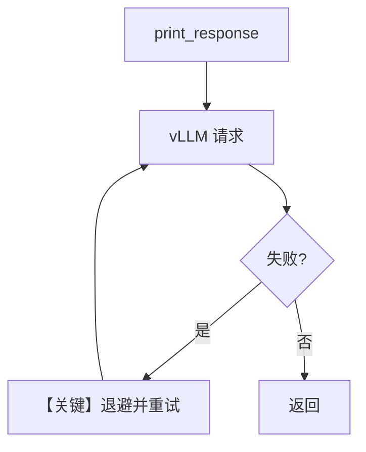

# retry.py — 实现原理分析

<!-- cookbook-py-source:start -->
## 完整源码

```python
"""Example demonstrating how to set up retries with vLLM."""

from agno.agent import Agent
from agno.models.vllm import vLLM

# ---------------------------------------------------------------------------
# Create Agent
# ---------------------------------------------------------------------------

# We will use a deliberately wrong model ID, to trigger retries.
wrong_model_id = "vllm-wrong-id"

agent = Agent(
    model=vLLM(
        id=wrong_model_id,
        retries=3,  # Number of times to retry the request.
        delay_between_retries=1,  # Delay between retries in seconds.
        exponential_backoff=True,  # If True, the delay between retries is doubled each time.
    ),
)

agent.print_response("What is the capital of France?")

# ---------------------------------------------------------------------------
# Run Agent
# ---------------------------------------------------------------------------

if __name__ == "__main__":
    pass
```

<!-- cookbook-py-source:end -->

> 源文件：`cookbook/90_models/vllm/retry.py`

## 概述

本示例演示 **vLLM** 模型类的 **重试**：使用错误 `id` 触发失败，依赖 `retries`、`delay_between_retries`、`exponential_backoff`。

**核心配置一览：**

| 配置项 | 值 | 说明 |
|--------|------|------|
| `model` | `vLLM(id=..., retries=3, delay_between_retries=1, exponential_backoff=True)` | 见下 |

> **说明**：当前 `libs/agno/agno/models/vllm/__init__.py` 仅导出 **`VLLM`**（大写）。若运行报 `ImportError`，请将源码中的 `vLLM` 改为 `VLLM`。

## 架构分层

与 Vertex `retry.py` 类似：用户 `print_response` → 模型 `invoke` 失败 → 重试循环。

## 核心组件解析

重试在模型适配层实现；vLLM 走 OpenAI 兼容客户端，连接失败或 4xx/5xx 时重试。

### 运行机制与因果链

1. 数据路径：单条 user 消息 → 多次 HTTP 尝试。
2. 副作用：无 db。
3. 分支：退避策略影响等待时间。
4. 定位：与 xAI/Vertex retry  cookbook 同构。

## System Prompt 组装

无显式 instructions/description；还原方式同其他最小示例（断点 `get_system_message`）。

## 完整 API 请求

`chat.completions.create` 失败时由外层重试封装再次调用。

## Mermaid 流程图



## 关键源码文件索引

| 文件 | 关键函数/类 | 作用 |
|------|------------|------|
| `agno/models/vllm/vllm.py` | `VLLM` | 客户端参数 |
| 模型基类 invoke | 重试 | 失败重发 |
