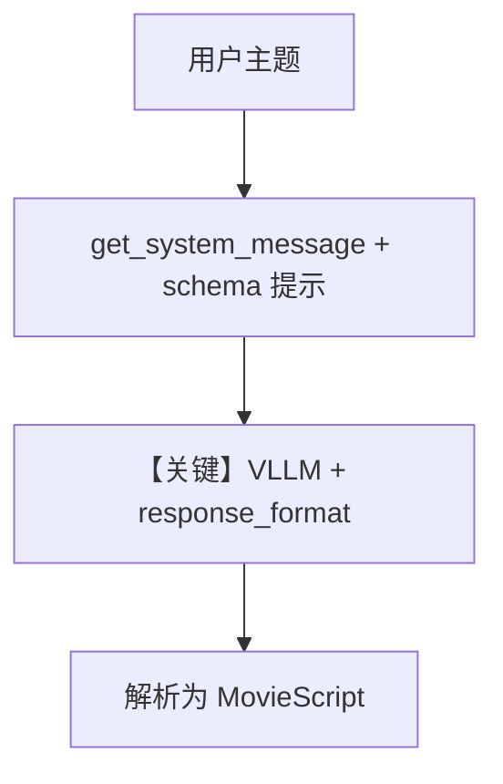

# structured_output.py — 实现原理分析

> 源文件：`cookbook/90_models/vllm/structured_output.py`

## 概述

本示例展示 **output_schema**：用 Pydantic 模型 **`MovieScript`** 约束 vLLM 输出字段；`description` 提供编剧人设。结构化由 Agno 在请求侧注入 JSON/schema 约束并解析响应。

**核心配置一览：**

| 配置项 | 值 | 说明 |
|--------|------|------|
| `model` | `VLLM(id="Qwen/Qwen2.5-7B-Instruct", top_k=20, enable_thinking=False)` | Chat Completions |
| `description` | `"You write movie scripts."` | system 描述 |
| `output_schema` | `MovieScript` | 结构化输出 |
| `markdown` | `None` | 未设置（且 `output_schema` 时通常不追加 markdown 句，见 `_messages.py` 中 markdown 与 schema 关系） |

## 架构分层

用户 → `get_system_message`（含 description、expected_output 或 schema 相关说明由框架添加）→ `VLLM.get_request_params(response_format=...)` → 提供商返回 JSON → 解析为 `MovieScript`。

## 核心组件解析

### output_schema

`output_schema` 会触发 `response_format` / 工具或 JSON 模式（依 OpenAILike 实现）；vLLM 需支持相应模式。

### 运行机制与因果链

1. 路径：用户主题「Llamas ruling the world」→ 模型生成符合 schema 的 JSON → `RunOutput.content` 为 Pydantic 对象或 dict。
2. 副作用：无。
3. 分支：解析失败时可能重试或报错（依实现）。
4. 定位：**vLLM 上的结构化输出**，与 xAI 版对照。

## System Prompt 组装

| 组成部分 | 生效 |
|----------|------|
| `description` | 是 |
| `markdown` | 本文件未设 True；若有 schema，system 另含期望输出说明 |

### 还原后的完整 System 文本（可确定部分）

```text
You write movie scripts.

```

（另含框架为 `output_schema` 附加的期望输出说明，须运行时打印确认。）

## 完整 API 请求

```python
# 概念：chat.completions.create(..., response_format=..., 或 tools)
# 与 MovieScript JSON Schema 对齐
```

## Mermaid 流程图



## 关键源码文件索引

| 文件 | 关键函数/类 | 作用 |
|------|------------|------|
| `agno/models/openai/like.py` | `get_request_params` | response_format |
| `agno/agent/agent.py` | `output_schema` 处理 | Run 解析 |
