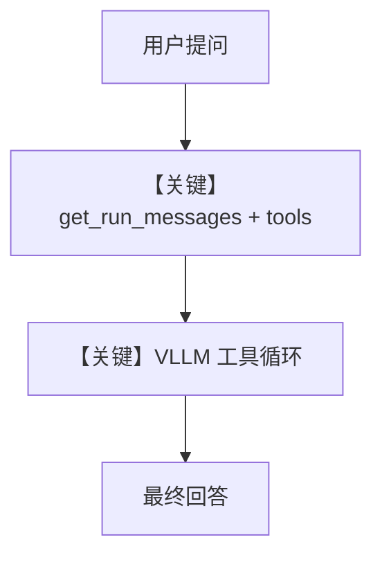

# tool_use.py — 实现原理分析

<!-- cookbook-py-source:start -->
## 完整源码

```python
"""Build a Web Search Agent using xAI."""

import asyncio

from agno.agent import Agent
from agno.models.vllm import VLLM
from agno.tools.websearch import WebSearchTools

# ---------------------------------------------------------------------------
# Create Agent
# ---------------------------------------------------------------------------

agent = Agent(
    model=VLLM(
        id="NousResearch/Nous-Hermes-2-Mistral-7B-DPO", top_k=20, enable_thinking=False
    ),
    tools=[WebSearchTools()],
    markdown=True,
)

# ---------------------------------------------------------------------------
# Run Agent
# ---------------------------------------------------------------------------
if __name__ == "__main__":
    # --- Sync ---
    agent.print_response("Whats happening in France?")

    # --- Sync + Streaming ---
    agent.print_response("Whats happening in France?", stream=True)

    # --- Async + Streaming ---
    asyncio.run(agent.aprint_response("Whats happening in France?", stream=True))
```

<!-- cookbook-py-source:end -->

> 源文件：`cookbook/90_models/vllm/tool_use.py`

## 概述

本示例在 **vLLM**（Nous-Hermes 等）上挂载 **WebSearchTools**，演示 **工具调用** 与多种 `print_response` 模式。文件头注释写「xAI」为历史笔误，实际代码为 **VLLM**。

**核心配置一览：**

| 配置项 | 值 | 说明 |
|--------|------|------|
| `model` | `VLLM(id="NousResearch/Nous-Hermes-2-Mistral-7B-DPO", top_k=20, enable_thinking=False)` | OpenAI 兼容 API |
| `tools` | `[WebSearchTools()]` | 搜索 |
| `markdown` | `True` | markdown 附加句 |

## 架构分层

与 `basic.py` 相同，多 **tools** 注入到 `chat.completions` 的 `tools` 字段；模型需支持 tool calling（服务端需配置 tool-call-parser 等，见其他 cookbook 说明）。

## 核心组件解析

### 运行机制与因果链

1. 路径：用户问法国新闻 → 模型可能发起 search 工具 → 汇总答案。
2. 副作用：无持久会话除非配置 db。
3. 分支：同步/流式/async 仅影响 IO 模式。
4. 定位：vLLM 上的 **联网 Agent**，与 xAI `tool_use.py` 平行。

## System Prompt 组装

含 `markdown` 段 + 工具说明（由框架注入）。

### 还原后的完整 System 文本（静态部分）

```text
Use markdown to format your answers.
```

（工具说明段运行时追加。）

## 完整 API 请求

```python
client.chat.completions.create(
    model="NousResearch/Nous-Hermes-2-Mistral-7B-DPO",
    messages=[...],
    tools=[...],  # WebSearchTools 序列化结果
    stream=...,
    extra_body={...},
)
```

## Mermaid 流程图



## 关键源码文件索引

| 文件 | 关键函数/类 | 作用 |
|------|------------|------|
| `agno/models/vllm/vllm.py` | `VLLM` | 请求 |
| `agno/tools/websearch/` | `WebSearchTools` | 工具定义 |
