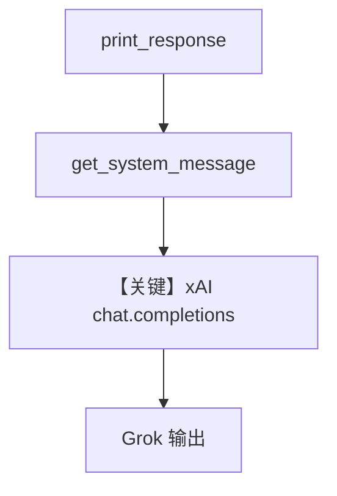

# basic.py — 实现原理分析

> 源文件：`cookbook/90_models/xai/basic.py`

## 概述

本示例展示 **xAI（Grok）** 通过 **`xAI`** 模型类（继承 `OpenAILike`）的最小用法：`gpt-4o` 等价物为 **`grok-2`**，并覆盖同步/流式/异步四种输出方式。

**核心配置一览：**

| 配置项 | 值 | 说明 |
|--------|------|------|
| `model` | `xAI(id="grok-2")` | Chat Completions（`https://api.x.ai/v1`） |
| `markdown` | `True` | 附加 markdown 说明 |
| `name` | `None` | 未设置 |
| `instructions` | `None` | 未设置 |

需环境变量 **`XAI_API_KEY`**（见 `agno/models/xai/xai.py` `_get_client_params`）。

## 架构分层

```
用户代码层 → Agent.print_response / aprint_response
          → get_system_message → get_run_messages
          → xAI.invoke → OpenAI 客户端 chat.completions.create
```

## 核心组件解析

### xAI 模型

`xAI`（`agno/models/xai/xai.py`）设置 `base_url` 为 xAI，并在 `get_request_params` 中合并 `search_parameters`（本文件未用）。

### 运行机制与因果链

1. **路径**：用户 horror story 提示 → system（markdown）+ user → Grok 返回。
2. **副作用**：无 db。
3. **分支**：`stream` 与 `async` 仅影响 IO。
4. **定位**：xAI 目录入门示例。

## System Prompt 组装

### 还原后的完整 System 文本

```text
Use markdown to format your answers.
```

## 完整 API 请求

```python
# OpenAILike → chat.completions.create
from openai import OpenAI
client = OpenAI(api_key=os.environ["XAI_API_KEY"], base_url="https://api.x.ai/v1")
client.chat.completions.create(
    model="grok-2",
    messages=[
        {"role": "system", "content": "<上节>"},
        {"role": "user", "content": "Share a 2 sentence horror story"},
    ],
    stream=False,
)
```

## Mermaid 流程图



## 关键源码文件索引

| 文件 | 关键函数/类 | 作用 |
|------|------------|------|
| `agno/models/xai/xai.py` | `xAI` L20+ | 客户端与请求参数 |
| `agno/models/openai/chat.py` | `chat.completions.create` | HTTP 调用 |
