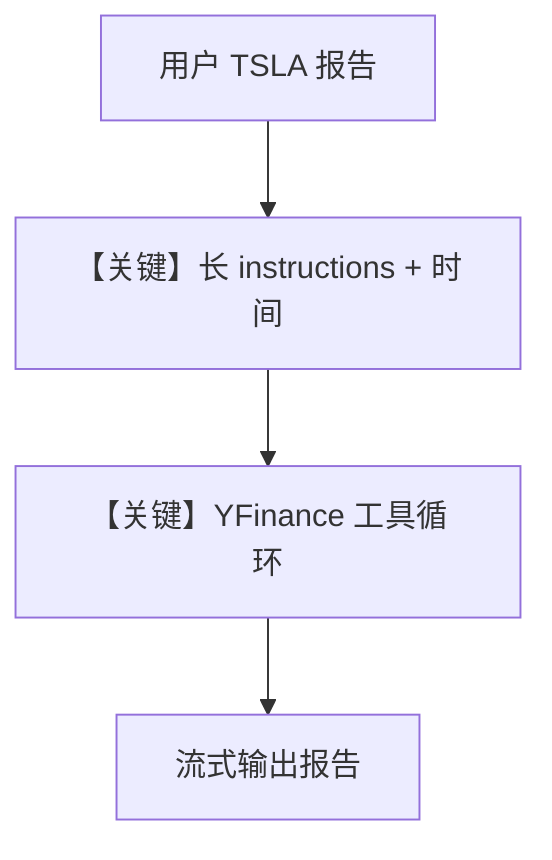

# finance_agent.py — 实现原理分析

<!-- cookbook-py-source:start -->
## 完整源码

```python
"""️ Finance Agent - Your Personal Market Analyst!

This example shows how to create a sophisticated financial analyst that provides
comprehensive market insights using real-time data. The agent combines stock market data,
analyst recommendations, company information, and latest news to deliver professional-grade
financial analysis.

Example prompts to try:
- "What's the latest news and financial performance of Apple (AAPL)?"
- "Give me a detailed analysis of Tesla's (TSLA) current market position"
- "How are Microsoft's (MSFT) financials looking? Include analyst recommendations"
- "Analyze NVIDIA's (NVDA) stock performance and future outlook"
- "What's the market saying about Amazon's (AMZN) latest quarter?"

Run: `uv pip install openai yfinance agno` to install the dependencies
"""

from textwrap import dedent

from agno.agent import Agent
from agno.models.xai import xAI
from agno.tools.yfinance import YFinanceTools

# ---------------------------------------------------------------------------
# Create Agent
# ---------------------------------------------------------------------------

finance_agent = Agent(
    model=xAI(id="grok-3-mini-beta"),
    tools=[YFinanceTools()],
    instructions=dedent("""\
        You are a seasoned Wall Street analyst with deep expertise in market analysis! 

        Follow these steps for comprehensive financial analysis:
        1. Market Overview
           - Latest stock price
           - 52-week high and low
        2. Financial Deep Dive
           - Key metrics (P/E, Market Cap, EPS)
        3. Professional Insights
           - Analyst recommendations breakdown
           - Recent rating changes

        4. Market Context
           - Industry trends and positioning
           - Competitive analysis
           - Market sentiment indicators

        Your reporting style:
        - Begin with an executive summary
        - Use tables for data presentation
        - Include clear section headers
        - Add emoji indicators for trends ( )
        - Highlight key insights with bullet points
        - Compare metrics to industry averages
        - Include technical term explanations
        - End with a forward-looking analysis

        Risk Disclosure:
        - Always highlight potential risk factors
        - Note market uncertainties
        - Mention relevant regulatory concerns
    """),
    add_datetime_to_context=True,
    markdown=True,
)

# Example usage with detailed market analysis request
finance_agent.print_response(
    "Write a comprehensive report on TSLA",
    stream=True,
)

# # Semiconductor market analysis example
# finance_agent.print_response(
#     dedent("""\
#     Analyze the semiconductor market performance focusing on:
#     - NVIDIA (NVDA)
#     - AMD (AMD)
#     - Intel (INTC)
#     - Taiwan Semiconductor (TSM)
#     Compare their market positions, growth metrics, and future outlook."""),
#     stream=True,
# )

# # Automotive market analysis example
# finance_agent.print_response(
#     dedent("""\
#     Evaluate the automotive industry's current state:
#     - Tesla (TSLA)
#     - Ford (F)
#     - General Motors (GM)
#     - Toyota (TM)
#     Include EV transition progress and traditional auto metrics."""),
#     stream=True,
# )

# More example prompts to explore:
"""
Advanced analysis queries:
1. "Compare Tesla's valuation metrics with traditional automakers"
2. "Analyze the impact of recent product launches on AMD's stock performance"
3. "How do Meta's financial metrics compare to its social media peers?"
4. "Evaluate Netflix's subscriber growth impact on financial metrics"
5. "Break down Amazon's revenue streams and segment performance"

Industry-specific analyses:
Semiconductor Market:
1. "How is the chip shortage affecting TSMC's market position?"
2. "Compare NVIDIA's AI chip revenue growth with competitors"
3. "Analyze Intel's foundry strategy impact on stock performance"
4. "Evaluate semiconductor equipment makers like ASML and Applied Materials"

Automotive Industry:
1. "Compare EV manufacturers' production metrics and margins"
2. "Analyze traditional automakers' EV transition progress"
3. "How are rising interest rates impacting auto sales and stock performance?"
4. "Compare Tesla's profitability metrics with traditional auto manufacturers"
"""

# ---------------------------------------------------------------------------
# Run Agent
# ---------------------------------------------------------------------------

if __name__ == "__main__":
    pass
```

<!-- cookbook-py-source:end -->

> 源文件：`cookbook/90_models/xai/finance_agent.py`

## 概述

本示例构建 **金融分析师 Agent**：**xAI Grok** + **YFinanceTools** + 长 **`instructions`**（华尔街分析步骤、表格、emoji 等）+ **`add_datetime_to_context=True`**，对 **TSLA** 等标的做综合报告。

**核心配置一览：**

| 配置项 | 值 | 说明 |
|--------|------|------|
| `model` | `xAI(id="grok-3-mini-beta")` | Chat Completions |
| `tools` | `[YFinanceTools()]` | 雅虎财经数据 |
| `instructions` | `dedent("""...""")` | 长段角色与流程（见下） |
| `add_datetime_to_context` | `True` | system 注入当前时间 |
| `markdown` | `True` | markdown 格式说明 |

## 架构分层

用户 `print_response("Write a comprehensive report on TSLA", stream=True)` → system（时间 + instructions + markdown + 工具说明）→ xAI → 可能多轮工具 → 报告文本。

## 核心组件解析

### YFinanceTools

提供股价、财务、新闻等函数供模型按需调用。

### add_datetime_to_context

`_messages.py` `# 3.2.2` 将当前时间写入 `<additional_information>`。

### 运行机制与因果链

1. **路径**：用户报告请求 → 模型分解任务 → 调用 YFinance → 汇总为长文。
2. **副作用**：无 Postgres；仅 API 调用。
3. **分支**：注释中另有半导体/汽车行业示例，默认未执行。
4. **定位**：xAI 上 **垂直领域 Agent**（金融）+ **强指令** 范例。

## System Prompt 组装

### 还原后的完整 System 文本（instructions 须原样）

instructions 为 `textwrap.dedent` 的多行字符串，**必须以源码为准完整复制**；此处因篇幅在文档中引用文件行 31-62。

读者请直接打开 `finance_agent.py` L31-L62 获取逐字正文。文档中确认包含：**角色**、**步骤 1-4**、**报告风格**、**Risk Disclosure**。

另追加：

```text
- The current time is <运行时格式化时间>.

Use markdown to format your answers.
```

（时间串为运行时生成。）

### 段落释义

- **分步指令**：约束先概览再深挖再风险，减少跳步回答。
- **时间与 markdown**：保证时效感知与可读版式。

## 完整 API 请求

`chat.completions.create`，`tools` 为 YFinance 的 schema；`stream=True` 时流式返回。

## Mermaid 流程图



## 关键源码文件索引

| 文件 | 关键函数/类 | 作用 |
|------|------------|------|
| `agno/tools/yfinance/` | `YFinanceTools` | 行情与基本面 |
| `agno/agent/_messages.py` | `# 3.2.2` datetime | 时间上下文 |
