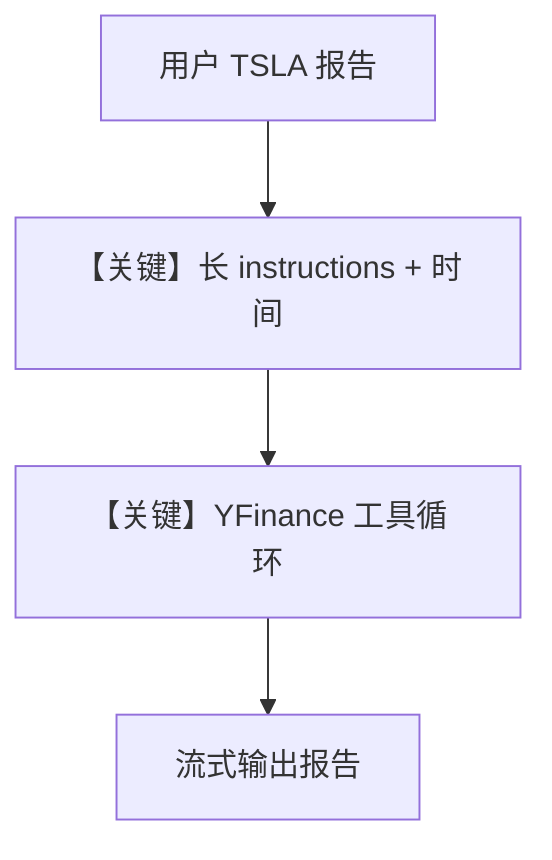

# finance_agent.py — 实现原理分析

> 源文件：`cookbook/90_models/xai/finance_agent.py`

## 概述

本示例构建 **金融分析师 Agent**：**xAI Grok** + **YFinanceTools** + 长 **`instructions`**（华尔街分析步骤、表格、emoji 等）+ **`add_datetime_to_context=True`**，对 **TSLA** 等标的做综合报告。

**核心配置一览：**

| 配置项 | 值 | 说明 |
|--------|------|------|
| `model` | `xAI(id="grok-3-mini-beta")` | Chat Completions |
| `tools` | `[YFinanceTools()]` | 雅虎财经数据 |
| `instructions` | `dedent("""...""")` | 长段角色与流程（见下） |
| `add_datetime_to_context` | `True` | system 注入当前时间 |
| `markdown` | `True` | markdown 格式说明 |

## 架构分层

用户 `print_response("Write a comprehensive report on TSLA", stream=True)` → system（时间 + instructions + markdown + 工具说明）→ xAI → 可能多轮工具 → 报告文本。

## 核心组件解析

### YFinanceTools

提供股价、财务、新闻等函数供模型按需调用。

### add_datetime_to_context

`_messages.py` `# 3.2.2` 将当前时间写入 `<additional_information>`。

### 运行机制与因果链

1. **路径**：用户报告请求 → 模型分解任务 → 调用 YFinance → 汇总为长文。
2. **副作用**：无 Postgres；仅 API 调用。
3. **分支**：注释中另有半导体/汽车行业示例，默认未执行。
4. **定位**：xAI 上 **垂直领域 Agent**（金融）+ **强指令** 范例。

## System Prompt 组装

### 还原后的完整 System 文本（instructions 须原样）

instructions 为 `textwrap.dedent` 的多行字符串，**必须以源码为准完整复制**；此处因篇幅在文档中引用文件行 31-62。

读者请直接打开 `finance_agent.py` L31-L62 获取逐字正文。文档中确认包含：**角色**、**步骤 1-4**、**报告风格**、**Risk Disclosure**。

另追加：

```text
- The current time is <运行时格式化时间>.

Use markdown to format your answers.
```

（时间串为运行时生成。）

### 段落释义

- **分步指令**：约束先概览再深挖再风险，减少跳步回答。
- **时间与 markdown**：保证时效感知与可读版式。

## 完整 API 请求

`chat.completions.create`，`tools` 为 YFinance 的 schema；`stream=True` 时流式返回。

## Mermaid 流程图



## 关键源码文件索引

| 文件 | 关键函数/类 | 作用 |
|------|------------|------|
| `agno/tools/yfinance/` | `YFinanceTools` | 行情与基本面 |
| `agno/agent/_messages.py` | `# 3.2.2` datetime | 时间上下文 |
