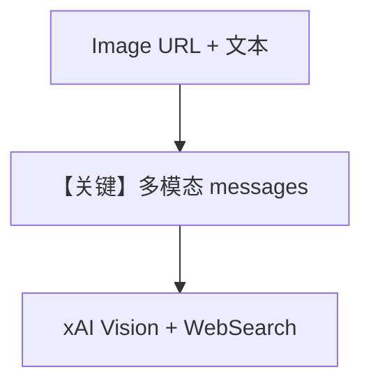

# image_agent.py — 实现原理分析

> 源文件：`cookbook/90_models/xai/image_agent.py`

## 概述

本示例使用 **Grok Vision**（`grok-2-vision-latest`）+ **WebSearchTools**：对用户提供的 **图片 URL** 与文本问题做多模态理解，并可联网查新闻。

**核心配置一览：**

| 配置项 | 值 | 说明 |
|--------|------|------|
| `model` | `xAI(id="grok-2-vision-latest")` | 视觉 + 文本 |
| `tools` | `[WebSearchTools()]` | 搜索 |
| `markdown` | `True` | markdown |

## 架构分层

`print_response(..., images=[Image(url=...)], stream=True)` → 消息中带 image parts → xAI API → 工具可选。

## 核心组件解析

### Image URL

`agno.media.Image` 封装 URL；适配器转为提供商所需格式（如 image_url）。

### 运行机制与因果链

1. **路径**：图像 + 文本 → 模型描述图像并可能搜索「最新新闻」。
2. **副作用**：下载图片由提供商侧或中间层处理；无本地 db。
3. **分支**：无搜索时也可仅凭图像与常识回答。
4. **定位**：与 `image_agent_bytes.py` 对照（URL vs 字节）。

## System Prompt 组装

含 markdown 句；无自定义 description/instructions。

### 还原后的完整 System 文本（静态）

```text
Use markdown to format your answers.
```

## 完整 API 请求

OpenAI 兼容多模态：`messages` 中 user 内容含 `text` + `image_url` 结构（具体字段以 `xAI`/`OpenAILike` 消息转换为准）。

## Mermaid 流程图



## 关键源码文件索引

| 文件 | 关键函数/类 | 作用 |
|------|------------|------|
| `agno/media/` | `Image` | 媒体载荷 |
| `agno/models/xai/xai.py` | `xAI` | 请求 |
