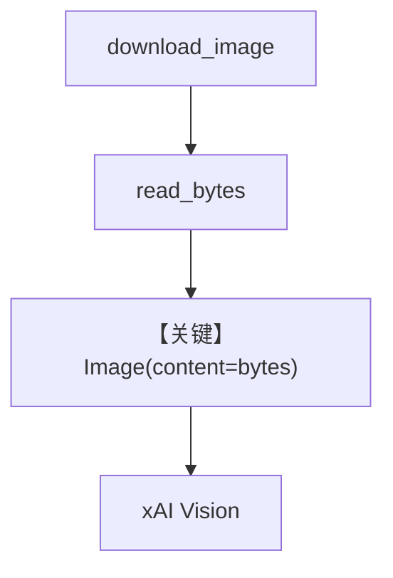

# image_agent_bytes.py — 实现原理分析

> 源文件：`cookbook/90_models/xai/image_agent_bytes.py`

## 概述

与 `image_agent.py` 相同模型与工具，区别是图片以 **本地字节** 形式传入：`download_image` 拉取金门大桥图，`Image(content=image_bytes)` 送入 Agent。

**核心配置一览：**

| 配置项 | 值 | 说明 |
|--------|------|------|
| `model` | `xAI(id="grok-2-vision-latest")` | Vision |
| `tools` | `[WebSearchTools()]` | 搜索 |
| `markdown` | `True` | 是 |

## 架构分层

磁盘/内存字节 → `Image(content=...)` → base64 或文件上传形态（依适配器）→ xAI。

## 核心组件解析

### download_image

`agno.utils.media.download_image` 将 URL 存为 `sample.jpg`，再 `read_bytes()`，便于离线复现。

### 运行机制与因果链

1. **路径**：字节图像 + 用户问题 → 多模态推理 + 可选搜索。
2. **副作用**：写入 `sample.jpg` 到脚本目录。
3. **分支**：与 URL 版一致。
4. **定位**：演示 **bytes 图像输入** 流水线。

## System Prompt 组装

同 `image_agent.md`；静态部分为 markdown 附加句。

## 完整 API 请求

user 消息中含 **inline image bytes**（通常编码为 base64 data URL）；其余同 Chat Completions。

## Mermaid 流程图

## 关键源码文件索引

| 文件 | 关键函数/类 | 作用 |
|------|------------|------|
| `agno/utils/media.py` | `download_image` | 拉图 |
| `agno/media/Image` | `content` | 字节载荷 |
