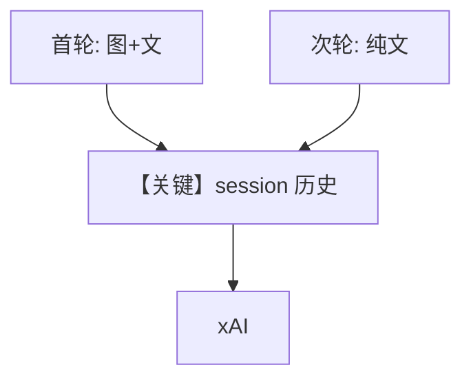

# image_agent_with_memory.py — 实现原理分析

<!-- cookbook-py-source:start -->
## 完整源码

```python
"""
Xai Image Agent With Memory
===========================

Cookbook example for `xai/image_agent_with_memory.py`.
"""

from agno.agent import Agent
from agno.media import Image
from agno.models.xai import xAI
from agno.tools.websearch import WebSearchTools

# ---------------------------------------------------------------------------
# Create Agent
# ---------------------------------------------------------------------------

agent = Agent(
    model=xAI(id="grok-2-vision-latest"),
    tools=[WebSearchTools()],
    markdown=True,
    add_history_to_context=True,
    num_history_runs=3,
)

agent.print_response(
    "Tell me about this image and give me the latest news about it.",
    images=[
        Image(
            url="https://upload.wikimedia.org/wikipedia/commons/0/0c/GoldenGateBridge-001.jpg"
        )
    ],
)

agent.print_response("Tell me where I can get more images?")

# ---------------------------------------------------------------------------
# Run Agent
# ---------------------------------------------------------------------------

if __name__ == "__main__":
    pass
```

<!-- cookbook-py-source:end -->

> 源文件：`cookbook/90_models/xai/image_agent_with_memory.py`

## 概述

在 **Vision + WebSearch** 基础上增加 **add_history_to_context=True** 与 **num_history_runs=3**：第二轮纯文本问题「哪里能找更多图片」可承接第一轮图像对话语境。

**核心配置一览：**

| 配置项 | 值 | 说明 |
|--------|------|------|
| `model` | `xAI(id="grok-2-vision-latest")` | Vision |
| `tools` | `[WebSearchTools()]` | 搜索 |
| `markdown` | `True` | 是 |
| `add_history_to_context` | `True` | 注入历史 |
| `num_history_runs` | `3` | 最近 3 轮 |

## 架构分层

第一轮：图像 + 文本 → 回复。第二轮：仅文本 → `get_run_messages` 附带历史 assistant/user → xAI。

## 核心组件解析

### 运行机制与因果链

1. **路径**：多轮消息进入同一 session；历史帮助解析指代。
2. **副作用**：默认内存/session 存储依赖 Agent 是否配置 `db`；本文件**未设 db**，历史通常在进程内 session（以框架默认为准）。
3. **分支**：无 db 时重启进程则历史丢失。
4. **定位**：**多模态 + 对话记忆** 最小示例。

## System Prompt 组装

同前；历史进入 **消息列表** 而非全部写入 system（依 `get_run_messages` 实现）。

### 还原后的完整 System 文本

静态段仍为 markdown 句；历史在 user/assistant 轮次中。

## 完整 API 请求

`messages` = [system, ..., user_1, assistant_1, user_2]；多模态仅首轮 user 含 image。

## Mermaid 流程图



## 关键源码文件索引

| 文件 | 关键函数/类 | 作用 |
|------|------------|------|
| `agno/agent/_messages.py` | `get_run_messages` | 历史条数 |
