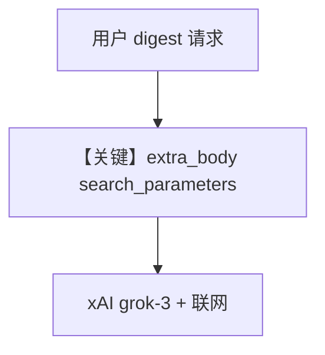

# live_search_agent.py — 实现原理分析

<!-- cookbook-py-source:start -->
## 完整源码

```python
"""
Xai Live Search Agent
=====================

Cookbook example for `xai/live_search_agent.py`.
"""

from agno.agent import Agent
from agno.models.xai.xai import xAI

# ---------------------------------------------------------------------------
# Create Agent
# ---------------------------------------------------------------------------

agent = Agent(
    model=xAI(
        id="grok-3",
        search_parameters={
            "mode": "on",
            "max_search_results": 20,
            "return_citations": True,
        },
    ),
    markdown=True,
)
agent.print_response("Provide me a digest of world news in the last 24 hours.")

# ---------------------------------------------------------------------------
# Run Agent
# ---------------------------------------------------------------------------

if __name__ == "__main__":
    pass
```

<!-- cookbook-py-source:end -->

> 源文件：`cookbook/90_models/xai/live_search_agent.py`

## 概述

本示例演示 xAI **Live Search**：在 **`xAI`** 上设置 **`search_parameters`**（`mode: on`、`max_search_results`、`return_citations`），由 `get_request_params` 写入 **`extra_body`**（`agno/models/xai/xai.py`），使 Grok 在回答时联网检索。

**核心配置一览：**

| 配置项 | 值 | 说明 |
|--------|------|------|
| `model` | `xAI(id="grok-3", search_parameters={...})` | 内置搜索 |
| `markdown` | `True` | 是 |
| `tools` | `None` | 未使用 WebSearchTools；搜索由提供商侧完成 |

## 架构分层

用户 → Agent → `xAI.get_request_params` 合并 `search_parameters` → `chat.completions.create` 带 `extra_body` → xAI 返回正文与可能的 citations。

## 核心组件解析

### search_parameters

`xAI` L76-L79：将 `search_parameters` 合并进 `extra_body`，与 OpenAI 兼容层其它字段共存。

### 运行机制与因果链

1. **路径**：世界新闻摘要请求 → 模型侧执行搜索 → 带引用列表（若 API 返回）。
2. **副作用**：无本地 db。
3. **分支**：与 `live_search_agent_stream.py` 仅差 `stream`。
4. **定位**：**原生 Live Search** vs 自建 `WebSearchTools`。

## System Prompt 组装

仅默认拼装 + markdown；无自定义 instructions。

### 还原后的完整 System 文本

```text
Use markdown to format your answers.
```

## 完整 API 请求

```python
client.chat.completions.create(
    model="grok-3",
    messages=[...],
    extra_body={
        "search_parameters": {
            "mode": "on",
            "max_search_results": 20,
            "return_citations": True,
        }
    },
)
```

## Mermaid 流程图



## 关键源码文件索引

| 文件 | 关键函数/类 | 作用 |
|------|------------|------|
| `agno/models/xai/xai.py` | `get_request_params` L59+ | search_parameters → extra_body |
