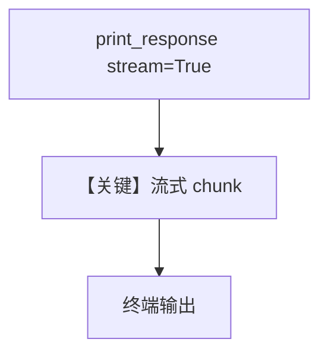

# live_search_agent_stream.py — 实现原理分析

> 源文件：`cookbook/90_models/xai/live_search_agent_stream.py`

## 概述

与 `live_search_agent.py` 相同：**grok-3** + **`search_parameters`**；区别是唯一调用使用 **`stream=True`**，流式输出新闻摘要。

**核心配置一览：**

| 配置项 | 值 | 说明 |
|--------|------|------|
| `model` | `xAI(id="grok-3", search_parameters={...})` | Live Search |
| `markdown` | `True` | 是 |

## 架构分层

`print_response(..., stream=True)` → 流式 chunk 消费 → 终端逐字显示。

## 核心组件解析

### 运行机制与因果链

1. **路径**：同非流式，但响应为 SSE/chunk 流。
2. **副作用**：无。
3. **分支**：`stream=False` 时见 `live_search_agent.py`。
4. **定位**：Live Search 的 **流式 UX**。

## System Prompt 组装

同 `live_search_agent.md`。

### 还原后的完整 System 文本

```text
Use markdown to format your answers.
```

## 完整 API 请求

`chat.completions.create(..., stream=True, extra_body={...})`。

## Mermaid 流程图



## 关键源码文件索引

| 文件 | 关键函数/类 | 作用 |
|------|------------|------|
| `agno/models/openai/chat.py` | 流式 create | chunk 迭代 |
