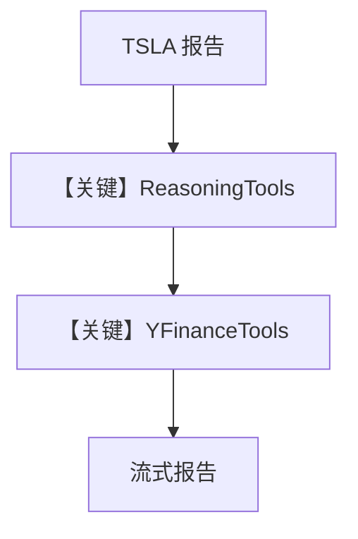

# reasoning_agent.py — 实现原理分析

> 源文件：`cookbook/90_models/xai/reasoning_agent.py`

## 概述

本示例组合 **ReasoningTools**（`add_instructions=True`, `add_few_shot=True`）与 **YFinanceTools**，使用 **grok-3-beta**，并开启 **`show_full_reasoning=True`** 展示推理过程，输出 **TSLA 报告**。

**核心配置一览：**

| 配置项 | 值 | 说明 |
|--------|------|------|
| `model` | `xAI(id="grok-3-beta")` | Chat |
| `tools` | `[ReasoningTools(...), YFinanceTools()]` | 推理链 + 行情 |
| `instructions` | `["Use tables...", "Only output the report..."]` | 列表形式 |
| `markdown` | `True` | 是 |

## 架构分层

用户 → system（instructions + markdown + 工具说明 + Reasoning 注入）→ 模型在工具与推理工具间多步 → 流式输出。

## 核心组件解析

### ReasoningTools

提供逐步推理辅助（具体为 `think`/计划类工具，以工具实现为准），`show_full_reasoning` 在 UI/日志中展开中间推理。

### 运行机制与因果链

1. **路径**：报告请求 → 推理工具与 YFinance 交替 → 最终仅报告正文（受 instructions 约束）。
2. **副作用**：无 db。
3. **分支**：`show_full_reasoning=True` 显示更多中间内容。
4. **定位**：**显式推理 + 金融工具** 的组合。

## System Prompt 组装

### 还原后的完整 System 文本（instructions 原样）

```text
Use tables to display data
Only output the report, no other text
```

（顺序与分隔依 `use_instruction_tags` 等；且含 markdown 附加句与 ReasoningTools 注入段。）

完整拼装需运行时打印；上列为源码中显式 **instructions 列表** 两项。

另：

```text
Use markdown to format your answers.
```

## 完整 API 请求

`chat.completions.create`，`tools` 合并两类工具 schema；`stream=True`。

## Mermaid 流程图



## 关键源码文件索引

| 文件 | 关键函数/类 | 作用 |
|------|------------|------|
| `agno/tools/reasoning/` | `ReasoningTools` | 推理辅助 |
| `agno/agent/agent.py` | `show_full_reasoning` | 推理展示 |
