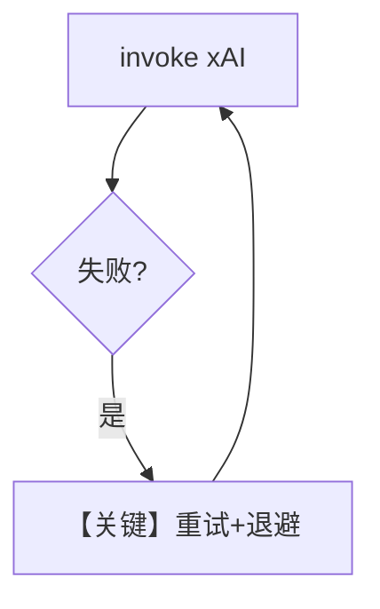

# retry.py — 实现原理分析

> 源文件：`cookbook/90_models/xai/retry.py`

## 概述

故意使用错误 **`grok-wrong-id`**，演示 **xAI** 模型上的 **retries / delay / exponential_backoff**（与 Vertex/vLLM retry 示例同模式）。

**核心配置一览：**

| 配置项 | 值 | 说明 |
|--------|------|------|
| `model` | `xAI(id=wrong_model_id, retries=3, delay_between_retries=1, exponential_backoff=True)` | 重试 |

## 架构分层

`print_response` → 请求失败 → 退避 → 重试直至次数用尽。

## 核心组件解析

### 运行机制与因果链

1. 单次 user 消息；无 tools。
2. 无 db 副作用。
3. 定位：**xAI 重试策略** 演示。

## System Prompt 组装

无显式文案；断点验证 `get_system_message`。

## 完整 API 请求

失败时重复 `chat.completions.create`。

## Mermaid 流程图

## 关键源码文件索引

| 文件 | 关键函数/类 | 作用 |
|------|------------|------|
| `agno/models/xai/xai.py` | `xAI` | 客户端 |
