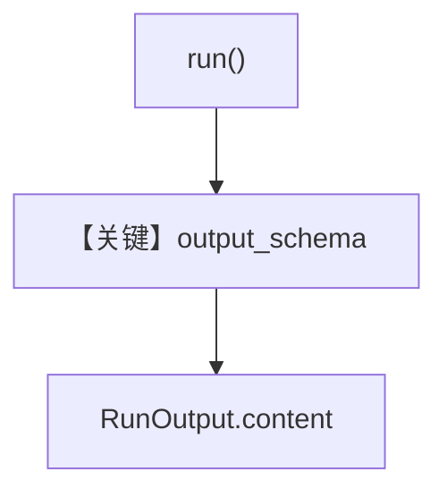

# structured_output.py — 实现原理分析

<!-- cookbook-py-source:start -->
## 完整源码

```python
"""
Xai Structured Output
=====================

Cookbook example for `xai/structured_output.py`.
"""

from typing import List

from agno.agent import Agent
from agno.models.xai.xai import xAI
from agno.run.agent import RunOutput
from pydantic import BaseModel, Field
from rich.pretty import pprint  # noqa

# ---------------------------------------------------------------------------
# Create Agent
# ---------------------------------------------------------------------------


class MovieScript(BaseModel):
    name: str = Field(..., description="Give a name to this movie")
    setting: str = Field(
        ..., description="Provide a nice setting for a blockbuster movie."
    )
    ending: str = Field(
        ...,
        description="Ending of the movie. If not available, provide a happy ending.",
    )
    genre: str = Field(
        ...,
        description="Genre of the movie. If not available, select action, thriller or romantic comedy.",
    )
    characters: List[str] = Field(..., description="Name of characters for this movie.")
    storyline: str = Field(
        ..., description="3 sentence storyline for the movie. Make it exciting!"
    )


# Agent that returns a structured output
structured_output_agent = Agent(
    model=xAI(id="grok-2-latest"),
    description="You write movie scripts.",
    output_schema=MovieScript,
)

# Run the agent synchronously
structured_output_response: RunOutput = structured_output_agent.run(
    "Llamas ruling the world"
)
pprint(structured_output_response.content)

# ---------------------------------------------------------------------------
# Run Agent
# ---------------------------------------------------------------------------

if __name__ == "__main__":
    pass
```

<!-- cookbook-py-source:end -->

> 源文件：`cookbook/90_models/xai/structured_output.py`

## 概述

使用 **`xAI(id="grok-2-latest")`** 与 **`output_schema=MovieScript`**，同步 **`run()`** 并用 **`pprint`** 打印 **`RunOutput.content`**（结构化对象）。

**核心配置一览：**

| 配置项 | 值 | 说明 |
|--------|------|------|
| `model` | `xAI(id="grok-2-latest")` | Chat |
| `description` | `"You write movie scripts."` | system |
| `output_schema` | `MovieScript` | Pydantic |

## 架构分层

`structured_output_agent.run("Llamas ruling the world")` → 请求带 response_format → 解析为 `MovieScript` → `RunOutput`。

## 核心组件解析

与 vLLM `structured_output.py` 同 schema；差异为 **xAI** 提供商与 **`grok-2-latest`**。

### 运行机制与因果链

1. 路径：主题 → JSON/结构化 → Pydantic 校验。
2. 无工具。
3. 定位：**xAI 结构化输出** 官方 cookbook 风格。

## System Prompt 组装

### 还原后的完整 System 文本（可确定）

```text
You write movie scripts.
```

（另含 schema 期望说明，由框架追加；请运行时打印。）

## 完整 API 请求

`chat.completions.create` + `response_format` 或等价（以 OpenAILike 为准）。

## Mermaid 流程图



## 关键源码文件索引

| 文件 | 关键函数/类 | 作用 |
|------|------------|------|
| `agno/run/agent.py` | `RunOutput` | 运行结果 |
| `agno/models/xai/xai.py` | `xAI` | 请求 |
