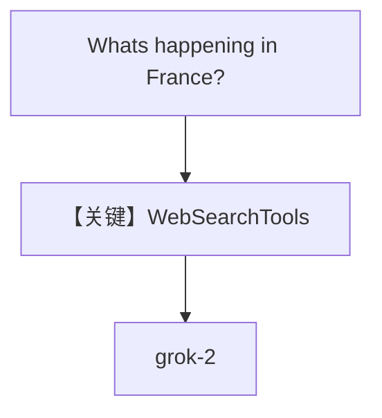

# tool_use.py — 实现原理分析

<!-- cookbook-py-source:start -->
## 完整源码

```python
"""Build a Web Search Agent using xAI."""

import asyncio

from agno.agent import Agent
from agno.models.xai import xAI
from agno.tools.websearch import WebSearchTools

# ---------------------------------------------------------------------------
# Create Agent
# ---------------------------------------------------------------------------

agent = Agent(
    model=xAI(id="grok-2"),
    tools=[WebSearchTools()],
    markdown=True,
)

# ---------------------------------------------------------------------------
# Run Agent
# ---------------------------------------------------------------------------
if __name__ == "__main__":
    # --- Sync ---
    agent.print_response("Whats happening in France?")

    # --- Sync + Streaming ---
    agent.print_response("Whats happening in France?", stream=True)

    # --- Async + Streaming ---
    asyncio.run(agent.aprint_response("Whats happening in France?", stream=True))
```

<!-- cookbook-py-source:end -->

> 源文件：`cookbook/90_models/xai/tool_use.py`

## 概述

**xAI Grok-2** + **WebSearchTools**，演示法国新闻等 **工具调用**；含同步、流式、异步三种调用（与 vLLM `tool_use.py` 结构相同，模型换为 xAI）。

**核心配置一览：**

| 配置项 | 值 | 说明 |
|--------|------|------|
| `model` | `xAI(id="grok-2")` | Chat Completions |
| `tools` | `[WebSearchTools()]` | 搜索 |
| `markdown` | `True` | 是 |

## 架构分层

用户 → `get_run_messages` + tools → `xAI` → tool 循环或单轮回答。

## 核心组件解析

### 运行机制与因果链

1. 路径：问题 → 模型选工具 → 执行 → 总结。
2. 无 db。
3. 定位：xAI 上 **联网搜索 Agent** 最小示例。

## System Prompt 组装

### 还原后的完整 System 文本

```text
Use markdown to format your answers.
```

（加工具说明。）

## 完整 API 请求

```python
client.chat.completions.create(
    model="grok-2",
    messages=[{"role": "system", "content": "..."}, {"role": "user", "content": "..."}],
    tools=[...],
)
```

## Mermaid 流程图



## 关键源码文件索引

| 文件 | 关键函数/类 | 作用 |
|------|------------|------|
| `agno/models/xai/xai.py` | `xAI` | API |
| `agno/tools/websearch/` | `WebSearchTools` | 工具 |
