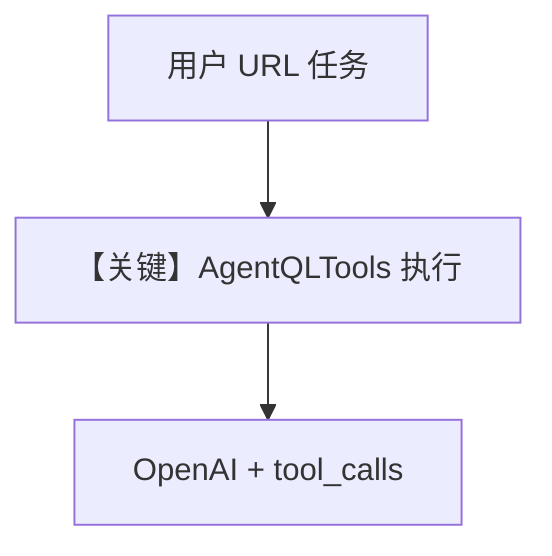

# agentql_tools.py — 实现原理分析

<!-- cookbook-py-source:start -->
## 完整源码

```python
"""
AgentQL Tools for scraping websites.

Prerequisites:
- Set the environment variable `AGENTQL_API_KEY` with your AgentQL API key.
  You can obtain the API key from the AgentQL website:
  https://agentql.com/
- Run `playwright install` to install a browser extension for playwright.

AgentQL will open up a browser instance (don't close it) and do scraping on the site.
"""

from agno.agent import Agent
from agno.models.openai import OpenAIChat
from agno.tools.agentql import AgentQLTools

# ---------------------------------------------------------------------------
# Create Agent
# ---------------------------------------------------------------------------


# Example 1: Enable specific AgentQL functions
agent = Agent(
    model=OpenAIChat(id="gpt-4o"),
    tools=[
        AgentQLTools(
            enable_scrape_website=True,
            enable_custom_scrape_website=False,
            agentql_query="your_query_here",
        )
    ],
)

# Example 2: Enable all AgentQL functions
agent_all = Agent(
    model=OpenAIChat(id="gpt-4o"),
    tools=[AgentQLTools(all=True, agentql_query="your_query_here")],
)

# Example 3: Custom query with specific function enabled
custom_query = """
{
    title
    text_content[]
}
"""

custom_agent = Agent(
    model=OpenAIChat(id="gpt-4o"),
    tools=[
        AgentQLTools(
            enable_scrape_website=True,
            enable_custom_scrape_website=True,
            agentql_query=custom_query,
        )
    ],
)

# Test the agents

# ---------------------------------------------------------------------------
# Run Agent
# ---------------------------------------------------------------------------
if __name__ == "__main__":
    agent.print_response(
        "Scrape the main content from https://docs.agno.com/introduction", markdown=True
    )
    custom_agent.print_response(
        "Extract title and content from https://docs.agno.com/introduction",
        markdown=True,
    )
```

<!-- cookbook-py-source:end -->

> 源文件：`cookbook/91_tools/agentql_tools.py`

## 概述

本示例展示 **AgentQLTools**：通过 **OpenAIChat** 驱动浏览器抓取站点；支持 **enable_** 开关、`all=True`、以及 **GraphQL 风格** 的 `agentql_query` 自定义查询。

**核心配置一览：**

| 配置项 | 值 | 说明 |
|--------|------|------|
| `model` | `OpenAIChat(id="gpt-4o")` | 三处 Agent 均显式设置 |
| `tools` | `AgentQLTools(...)` | 见源码三例不同配置 |
| `markdown` | `True`（`print_response` 参数） | 输出格式 |

## 架构分层

用户 `print_response` → `get_run_messages`（system + user）→ OpenAI Chat Completions + **tools**（AgentQL 注册的函数）→ 工具在本地执行（Playwright 等）。

## 核心组件解析

### AgentQLTools

需 **`AGENTQL_API_KEY`** 与 `playwright install`；`enable_scrape_website` / `enable_custom_scrape_website` 控制能力面。

### 运行机制与因果链

1. **路径**：自然语言 URL → 模型决定是否调用 scrape → 返回结构化或文本结果。
2. **副作用**：启动浏览器进程；无 Agno DB。
3. **分支**：`custom_agent` 使用自定义 `custom_query` 块。
4. **定位**：**可编程网页抓取** 与 Agno Agent 组合。

## System Prompt 组装

未设 `Agent(..., instructions=)`；默认 `build_context=True` 时含 markdown 相关附加（若 `markdown=True` 在 Agent 构造未传，则依赖 `print_response(markdown=True)` 行为以运行时为准）。建议在 `get_system_message` 打印确认。

### 还原后的完整 System 文本

本文件未在 `Agent` 上设置 `instructions`/`description`；静态可确定部分需运行时补齐。验证：`get_system_message()` 断点。

## 完整 API 请求

```python
# OpenAI Chat Completions
client.chat.completions.create(
    model="gpt-4o",
    messages=[{"role": "system", "content": "..."}, {"role": "user", "content": "..."}],
    tools=[...],  # AgentQL 工具 schema
)
```

## Mermaid 流程图



## 关键源码文件索引

| 文件 | 关键函数/类 | 作用 |
|------|------------|------|
| `agno/tools/agentql/` | `AgentQLTools` | 浏览器与查询 |
| `agno/agent/_messages.py` | `get_run_messages` | 注入 tools |
