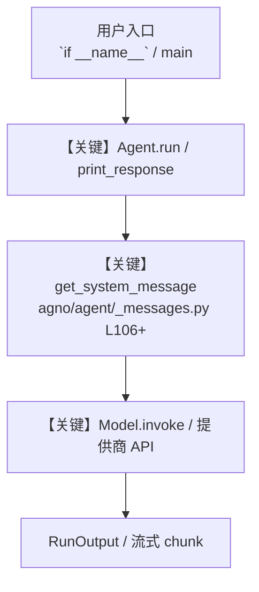

# airflow_tools.py — 实现原理分析

<!-- cookbook-py-source:start -->
## 完整源码

```python
"""
Airflow Tools - DAG Management and Workflow Automation

This example demonstrates how to use AirflowTools for managing Apache Airflow DAGs.
Shows enable_ flag patterns for selective function access.
AirflowTools is a small tool (<6 functions) so it uses enable_ flags.

Run: `uv pip install apache-airflow` to install the dependencies
"""

from agno.agent import Agent
from agno.tools.airflow import AirflowTools

# ---------------------------------------------------------------------------
# Create Agent
# ---------------------------------------------------------------------------


# Example 1: All functions enabled (default behavior)
agent_full = Agent(
    tools=[AirflowTools(dags_dir="tmp/dags")],  # All functions enabled by default
    description="You are an Airflow specialist with full DAG management capabilities.",
    instructions=[
        "Help users create, read, and manage Airflow DAGs",
        "Ensure DAG files follow Airflow best practices",
        "Provide clear explanations of DAG structure and components",
    ],
    markdown=True,
)

# Example 2: Enable specific functions using enable_ flags
agent_readonly = Agent(
    tools=[
        AirflowTools(
            dags_dir="tmp/dags",
            enable_save_dag_file=False,  # Disable DAG creation
            enable_read_dag_file=True,  # Enable DAG reading
        )
    ],
    description="You are an Airflow analyst focused on reading and analyzing existing DAGs.",
    instructions=[
        "Analyze existing DAG files and provide insights",
        "Explain DAG structure and dependencies",
        "Cannot create or modify DAGs, only read them",
    ],
    markdown=True,
)

# Example 3: Enable all functions explicitly
agent_explicit = Agent(
    tools=[
        AirflowTools(
            dags_dir="tmp/dags",
            enable_save_dag_file=True,
            enable_read_dag_file=True,
        )
    ],
    description="You are an Airflow developer with explicit permissions for all DAG operations.",
    instructions=[
        "Create and manage Airflow DAGs with best practices",
        "Read existing DAGs to understand current workflows",
        "Provide comprehensive DAG analysis and recommendations",
    ],
    markdown=True,
)

# Example 4: Using the 'all=True' pattern
agent_all = Agent(
    tools=[AirflowTools(dags_dir="tmp/dags", all=True)],  # Enable all functions
    description="You are a comprehensive Airflow manager with all capabilities enabled.",
    instructions=[
        "Manage complete Airflow workflows and DAG lifecycle",
        "Create, read, and analyze DAGs as needed",
        "Provide end-to-end Airflow development support",
    ],
    markdown=True,
)

# Use the full agent for the main example
agent = agent_full


dag_content = """
from airflow import DAG
from airflow.operators.python import PythonOperator
from datetime import datetime, timedelta

default_args = {
    'owner': 'airflow',
    'depends_on_past': False,
    'start_date': datetime(2024, 1, 1),
    'email_on_failure': False,
    'email_on_retry': False,
    'retries': 1,
    'retry_delay': timedelta(minutes=5),
}

# Using 'schedule' instead of deprecated 'schedule_interval'
with DAG(
    'example_dag',
    default_args=default_args,
    description='A simple example DAG',
    schedule='@daily',  # Changed from schedule_interval
    catchup=False
) as dag:

    def print_hello():
        print("Hello from Airflow!")
        return "Hello task completed"

    task = PythonOperator(
        task_id='hello_task',
        python_callable=print_hello,
        dag=dag,
    )
"""

# ---------------------------------------------------------------------------
# Run Agent
# ---------------------------------------------------------------------------
if __name__ == "__main__":
    agent.run(f"Save this DAG file as 'example_dag.py': {dag_content}")

    agent.print_response("Read the contents of 'example_dag.py'")
```

<!-- cookbook-py-source:end -->

> 源文件：`cookbook/91_tools/airflow_tools.py`

## 概述

Airflow Tools - DAG Management and Workflow Automation

本示例归类：**单 Agent**；模型相关类型：`（见源码 import）`。

**核心配置一览：**

| 配置项 | 值 | 说明 |
|--------|------|------|
| `description` | 'You are an Airflow specialist with full DAG management capabilities.' | `Agent(...)` |
| `markdown` | True | `Agent(...)` |

## 架构分层

```
用户 / cookbook 示例              Agno 框架
┌──────────────────────┐         ┌────────────────────────────────┐
│ airflow_tools.py     │  ──▶  │ Agent → get_run_messages → Model │
└──────────────────────┘         └────────────────────────────────┘
                                          │
                                          ▼
                                  ┌───────────────┐
                                  │ 对应 Model 子类 │
                                  └───────────────┘
```

## 核心组件解析

### 运行机制与因果链

1. **入口**：从模块 `__main__` 或暴露的 `agent` / `team` 调用进入；同步用 `print_response` / `run`，异步用 `aprint_response` / `arun`（若源码中有）。
2. **消息**：默认路径下 system 内容由 `get_system_message()`（`libs/agno/agno/agent/_messages.py` 约 **L106** 起）按分段逻辑拼装；若显式传入 `system_message` 则早退使用该字符串。
3. **模型**：具体 HTTP/SDK 形态以 `libs/agno/agno/models/` 下对应类的 `invoke` / `ainvoke` 为准（勿默认写成单一 `chat.completions`）。
4. **副作用**：若配置 `db`、`knowledge`、`memory`，运行会读写存储；仅以本文件为准对照。

### 与框架的衔接

- **System**：`get_system_message()` 锚点 `agno/agent/_messages.py` **L106+**。
- **运行**：`Agent.print_response` 等入口 `agno/agent/agent.py`（以当前仓库检索为准）。

## System Prompt 组装

| 序号 | 组成部分 | 本文件 | 是否生效 |
|------|---------|--------|---------|
| 1 | `instructions` / `description` 等 | 见核心配置表与源码 | 有赋值则生效 |
| 2 | 默认分段（markdown、时间等） | 取决于 `Agent` 默认与显式参数 | 视参数 |

### 拼装顺序与源码锚点

1. `system_message` 直给 → 使用该内容（见 `_messages.py` 文档字符串分支说明）。
2. 否则默认拼装：`description`、`role`、`instructions`、markdown 附加段等按 `# 3.x` 注释顺序合并。

### 还原后的完整 System 文本

```text
--- description ---
You are an Airflow specialist with full DAG management capabilities.
```

### 段落释义（模型视角）

- 指令与安全边界由 `instructions` / `system_message` 约束；若带 `tools` / `knowledge`，文档中需体现「何时检索/调用」由框架注入的提示段支持。

## 完整 API 请求

```python
# 请以本文件实际 Model 为准打开 libs/agno/agno/models/<厂商>/ 下对应类的 invoke：
# 可能是 chat.completions.create、responses.create、Gemini generate_content 等。
```

> 与上一节 system 文本在同一 run 中组合；`developer`/`system` 角色由适配器转换。



**【关键】节点说明：**

- **print_response / run**：用户可见的同步入口。
- **get_system_message**：系统提示拼装核心。
- **Model.invoke**：对模型提供商的实际请求。

## 关键源码文件索引

| 文件 | 作用 |
|------|------|
| `agno/agent/_messages.py` | `get_system_message()` L106+ |
| `agno/agent/agent.py` | `Agent` 运行与 CLI 输出 |
| `agno/models/` | 各厂商 `Model.invoke` |
