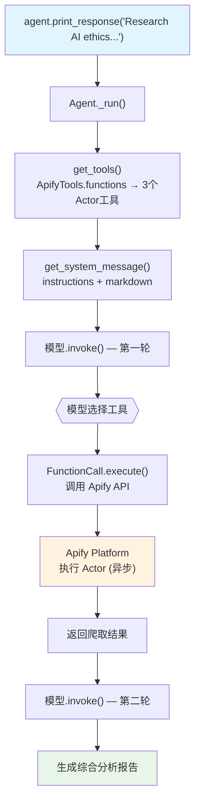

# apify_tools.py — 实现原理分析

> 源文件：`cookbook/91_tools/apify_tools.py`

## 概述

本示例展示 Agno 的 **`ApifyTools`** 集成机制：通过 Apify 平台的 Actor（无服务器工具）实现网络爬取、Google Places 搜索、TikTok 抓取等多类数据提取任务。`ApifyTools` 通过 `actors` 参数配置需要使用的 Apify Actor 列表，每个 Actor 自动注册为一个工具函数。

**核心配置一览：**

| 配置项 | 值 | 说明 |
|--------|------|------|
| `name` | `"Web Insights Explorer"` | Agent 名称 |
| `model` | `None` | 未显式设置 |
| `tools` | `[ApifyTools(actors=[...])]` | Apify 多 Actor 工具集 |
| `instructions` | 列表形式，web 研究助手指令 | 注入 system prompt |
| `markdown` | `True` | Markdown 格式化 |
| `ApifyTools actors` | `["apify/rag-web-browser", "compass/crawler-google-places", "clockworks/free-tiktok-scraper"]` | 3 个 Apify Actor |

## 架构分层

```
用户代码层                      agno.agent 层
┌─────────────────────────┐    ┌────────────────────────────────────┐
│ apify_tools.py          │    │ Agent._run()                       │
│                         │    │  ├─ get_tools()                    │
│ ApifyTools(             │    │  │   ApifyTools.functions           │
│   actors=[              │───>│  │   → 每个 Actor 注册为 Function  │
│     "apify/rag-web-...",│    │  │                                  │
│     "compass/crawler..",│    │  └─ FunctionCall.execute()         │
│     "clockworks/free..",│    │      → 调用 Apify API              │
│   ]                     │    │      → 执行指定 Actor              │
│ )                       │    └────────────────────────────────────┘
└─────────────────────────┘
                │ APIFY_API_TOKEN
                ▼
    ┌───────────────────────┐
    │ Apify Platform        │
    │ Actor 执行结果         │
    └───────────────────────┘
```

## 核心组件解析

### ApifyTools 与 Actor 注册

`ApifyTools` 是 `Toolkit` 的子类，在初始化时根据 `actors` 列表动态注册工具：

```python
class ApifyTools(Toolkit):
    def __init__(self, actors: List[str], api_key: Optional[str] = None):
        super().__init__(name="apify_tools")
        self.client = ApifyClient(api_key or os.getenv("APIFY_API_TOKEN"))
        
        # 为每个 Actor 注册对应的工具函数
        for actor in actors:
            self.register(self._create_actor_tool(actor))
```

每个 Actor 的工具名基于 Actor ID 生成（如 `apify_rag_web_browser`），LLM 通过工具名调用对应的 Apify Actor。

### 依赖要求

```
uv pip install agno langchain-apify apify-client
APIFY_API_TOKEN=your_token  # .env 文件
```

### 三种 Actor 的用途

| Actor | 功能 | 使用场景 |
|-------|------|---------|
| `apify/rag-web-browser` | RAG 增强的网页浏览和内容提取 | 多源信息汇总、URL 内容提取 |
| `compass/crawler-google-places` | Google Maps 商户信息爬取 | 本地商家搜索、POI 数据 |
| `clockworks/free-tiktok-scraper` | TikTok 公开数据抓取 | 社交媒体分析 |

## System Prompt 组装

| 序号 | 组成部分 | 本文件中的值/来源 | 是否生效 |
|------|---------|-----------------|---------|
| 1 | `system_message` | `None` | 否 |
| 3.1 | `instructions` | 列表形式 web 研究助手指令 | 是 |
| 3.1.1 | 模型指令 | 模型特定指令 | 是 |
| 3.2.1 | `markdown` | `True` → "Use markdown to format your answers." | 是 |
| 3.3.3 | instructions 拼接 | 写入 system message | 是 |

### 最终 System Prompt

```text
You are a sophisticated web research assistant capable of extracting insights from various online sources. Use the available tools for your tasks to gather accurate, well-structured information.

Use markdown to format your answers.
```

## 完整 API 请求

```python
client.chat.completions.create(
    model="<default-model>",
    messages=[
        {"role": "system", "content": "You are a sophisticated web research assistant...\n\nUse markdown to format your answers."},
        {"role": "user", "content": "Research the latest AI ethics guidelines..."}
    ],
    tools=[
        {"type": "function", "function": {"name": "apify_rag_web_browser", "description": "...", ...}},
        {"type": "function", "function": {"name": "compass_crawler_google_places", "description": "...", ...}},
        {"type": "function", "function": {"name": "clockworks_free_tiktok_scraper", "description": "...", ...}}
    ],
    stream=True
)
```

## Mermaid 流程图



## 关键源码文件索引

| 文件 | 关键函数/类 | 作用 |
|------|------------|------|
| `agno/tools/apify.py` | `ApifyTools` | Apify Actor 工具集 |
| `agno/tools/toolkit.py` | `Toolkit.register()` | 注册 Actor 工具函数 |
| `agno/agent/_tools.py` | `get_tools()` L105 | 收集工具列表 |
| `agno/agent/_messages.py` | `get_system_message()` L106 | 组装 system prompt |
