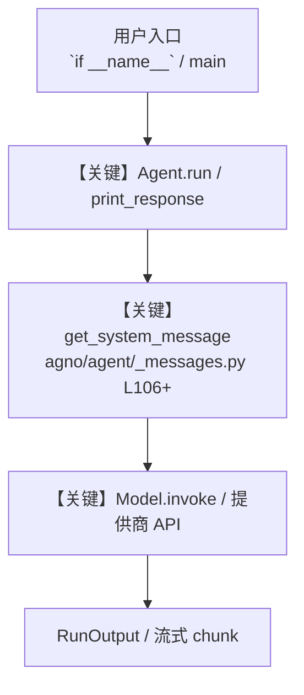

# aws_lambda_tools.py — 实现原理分析

<!-- cookbook-py-source:start -->
## 完整源码

```python
"""
AWS Lambda Tools - Serverless Function Management

This example demonstrates how to use AWSLambdaTools for AWS Lambda operations.
Shows enable_ flag patterns for selective function access.
AWSLambdaTools is a small tool (<6 functions) so it uses enable_ flags.

Prerequisites:
- Run: `uv pip install boto3` to install dependencies
- Set up AWS credentials (AWS CLI, environment variables, or IAM roles)
- Ensure proper IAM permissions for Lambda operations
"""

from agno.agent import Agent
from agno.tools.aws_lambda import AWSLambdaTools

# ---------------------------------------------------------------------------
# Create Agent
# ---------------------------------------------------------------------------


# Example 1: All functions enabled (default behavior)
agent_full = Agent(
    tools=[AWSLambdaTools(region_name="us-east-1")],  # All functions enabled
    name="Full AWS Lambda Agent",
    description="You are a comprehensive AWS Lambda specialist with all serverless capabilities.",
    instructions=[
        "Help users with all AWS Lambda operations including listing, invoking, and managing functions",
        "Provide clear explanations of Lambda operations and results",
        "Ensure proper error handling for AWS operations",
        "Format responses clearly using markdown",
    ],
    markdown=True,
)

# Example 2: Enable only function listing and invocation
agent_basic = Agent(
    tools=[
        AWSLambdaTools(
            region_name="us-east-1",
            enable_list_functions=True,
            enable_invoke_function=True,
        )
    ],
    name="Lambda Reader Agent",
    description="You are an AWS Lambda specialist focused on reading and invoking existing functions.",
    instructions=[
        "List and invoke existing Lambda functions",
        "Cannot create or modify Lambda functions",
        "Provide insights about function execution and performance",
        "Focus on function monitoring and execution",
    ],
    markdown=True,
)

# Example 3: Enable all functions using 'all=True' pattern
agent_comprehensive = Agent(
    tools=[AWSLambdaTools(region_name="us-east-1", all=True)],
    name="Comprehensive Lambda Agent",
    description="You are a full-featured AWS Lambda manager with all capabilities enabled.",
    instructions=[
        "Manage complete AWS Lambda lifecycle including creation, updates, and deployments",
        "Provide comprehensive serverless architecture guidance",
        "Support advanced Lambda configurations and optimizations",
        "Handle complex serverless workflows and integrations",
    ],
    markdown=True,
)

# Example 4: Invoke-only agent for testing
agent_tester = Agent(
    tools=[
        AWSLambdaTools(
            region_name="us-east-1",
            enable_list_functions=True,
            enable_invoke_function=True,
        )
    ],
    name="Lambda Tester Agent",
    description="You are an AWS Lambda testing specialist focused on safe function execution.",
    instructions=[
        "Test and validate Lambda function execution",
        "Cannot create or delete functions for safety",
        "Provide detailed execution results and performance metrics",
        "Focus on function testing and validation workflows",
    ],
    markdown=True,
)

# Example usage

# ---------------------------------------------------------------------------
# Run Agent
# ---------------------------------------------------------------------------
if __name__ == "__main__":
    print("=== Basic Lambda Operations Example ===")
    agent_basic.print_response(
        "List all Lambda functions in our AWS account", markdown=True
    )

    print("\n=== Function Testing Example ===")
    agent_tester.print_response(
        "Invoke the 'hello-world' Lambda function with an empty payload and analyze the results",
        markdown=True,
    )

    print("\n=== Comprehensive Management Example ===")
    agent_comprehensive.print_response(
        "Provide an overview of our Lambda environment including function count, runtimes, and recent activity",
        markdown=True,
    )

    # Note: Make sure you have the necessary AWS credentials set up in your environment
    # or use AWS CLI's configure command to set them up before running this script.
```

<!-- cookbook-py-source:end -->

> 源文件：`cookbook/91_tools/aws_lambda_tools.py`

## 概述

AWS Lambda Tools - Serverless Function Management

本示例归类：**单 Agent**；模型相关类型：`（见源码 import）`。

**核心配置一览：**

| 配置项 | 值 | 说明 |
|--------|------|------|
| `name` | 'Full AWS Lambda Agent' | `Agent(...)` |
| `description` | 'You are a comprehensive AWS Lambda specialist with all serverless capabilities.' | `Agent(...)` |
| `markdown` | True | `Agent(...)` |

## 架构分层

```
用户 / cookbook 示例              Agno 框架
┌──────────────────────┐         ┌────────────────────────────────┐
│ aws_lambda_tools.py  │  ──▶  │ Agent → get_run_messages → Model │
└──────────────────────┘         └────────────────────────────────┘
                                          │
                                          ▼
                                  ┌───────────────┐
                                  │ 对应 Model 子类 │
                                  └───────────────┘
```

## 核心组件解析

### 运行机制与因果链

1. **入口**：从模块 `__main__` 或暴露的 `agent` / `team` 调用进入；同步用 `print_response` / `run`，异步用 `aprint_response` / `arun`（若源码中有）。
2. **消息**：默认路径下 system 内容由 `get_system_message()`（`libs/agno/agno/agent/_messages.py` 约 **L106** 起）按分段逻辑拼装；若显式传入 `system_message` 则早退使用该字符串。
3. **模型**：具体 HTTP/SDK 形态以 `libs/agno/agno/models/` 下对应类的 `invoke` / `ainvoke` 为准（勿默认写成单一 `chat.completions`）。
4. **副作用**：若配置 `db`、`knowledge`、`memory`，运行会读写存储；仅以本文件为准对照。

### 与框架的衔接

- **System**：`get_system_message()` 锚点 `agno/agent/_messages.py` **L106+**。
- **运行**：`Agent.print_response` 等入口 `agno/agent/agent.py`（以当前仓库检索为准）。

## System Prompt 组装

| 序号 | 组成部分 | 本文件 | 是否生效 |
|------|---------|--------|---------|
| 1 | `instructions` / `description` 等 | 见核心配置表与源码 | 有赋值则生效 |
| 2 | 默认分段（markdown、时间等） | 取决于 `Agent` 默认与显式参数 | 视参数 |

### 拼装顺序与源码锚点

1. `system_message` 直给 → 使用该内容（见 `_messages.py` 文档字符串分支说明）。
2. 否则默认拼装：`description`、`role`、`instructions`、markdown 附加段等按 `# 3.x` 注释顺序合并。

### 还原后的完整 System 文本

```text
--- description ---
You are a comprehensive AWS Lambda specialist with all serverless capabilities.
```

### 段落释义（模型视角）

- 指令与安全边界由 `instructions` / `system_message` 约束；若带 `tools` / `knowledge`，文档中需体现「何时检索/调用」由框架注入的提示段支持。

## 完整 API 请求

```python
# 请以本文件实际 Model 为准打开 libs/agno/agno/models/<厂商>/ 下对应类的 invoke：
# 可能是 chat.completions.create、responses.create、Gemini generate_content 等。
```

> 与上一节 system 文本在同一 run 中组合；`developer`/`system` 角色由适配器转换。



**【关键】节点说明：**

- **print_response / run**：用户可见的同步入口。
- **get_system_message**：系统提示拼装核心。
- **Model.invoke**：对模型提供商的实际请求。

## 关键源码文件索引

| 文件 | 作用 |
|------|------|
| `agno/agent/_messages.py` | `get_system_message()` L106+ |
| `agno/agent/agent.py` | `Agent` 运行与 CLI 输出 |
| `agno/models/` | 各厂商 `Model.invoke` |
