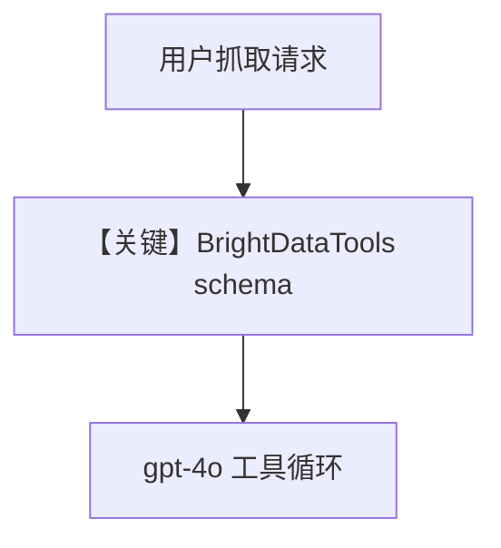

# brightdata_tools.py — 实现原理分析

<!-- cookbook-py-source:start -->
## 完整源码

```python
"""
Brightdata Tools
=============================

Demonstrates brightdata tools.
"""

from agno.agent import Agent
from agno.models.openai import OpenAIChat
from agno.tools.brightdata import BrightDataTools

# ---------------------------------------------------------------------------
# Create Agent
# ---------------------------------------------------------------------------


# Example 1: Include specific BrightData functions for web scraping
scraping_agent = Agent(
    model=OpenAIChat(id="gpt-4o"),
    tools=[
        BrightDataTools(include_tools=["web_scraper", "serp_google", "serp_amazon"])
    ],
    markdown=True,
)

# Example 2: Exclude screenshot functions for performance
no_screenshot_agent = Agent(
    model=OpenAIChat(id="gpt-4o"),
    tools=[BrightDataTools(exclude_tools=["screenshot_generator"])],
    markdown=True,
)

# Example 3: Full BrightData functionality (default)
agent = Agent(
    model=OpenAIChat(id="gpt-4o"),
    tools=[BrightDataTools()],
    markdown=True,
)

# Example 1: Scrape a webpage as Markdown

# ---------------------------------------------------------------------------
# Run Agent
# ---------------------------------------------------------------------------
if __name__ == "__main__":
    agent.print_response(
        "Scrape this webpage as markdown: https://docs.agno.com/introduction",
    )

    # Example 2: Take a screenshot of a webpage
    # agent.print_response(
    #     "Take a screenshot of this webpage: https://docs.agno.com/introduction",
    # )

    # response = agent.run_response
    # if response.images:
    #     save_base64_data(response.images[0].content, "tmp/agno_screenshot.png")

    # Add a new SERP API zone: https://brightdata.com/cp/zones/new
    # Example 3: Search using Google
    # agent.print_response(
    #     "Search Google for 'Python web scraping best practices' and give me the top 5 results",
    # )

    # Example 4: Get structured data from Amazon product
    # agent.print_response(
    #     "Get detailed product information from this Amazon product: https://www.amazon.com/dp/B0D2Q9397Y?th=1&psc=1",
    # )

    # Example 5: Get LinkedIn profile data
    # agent.print_response(
    #     "Search for Satya Nadella on LinkedIn and give me a summary of his profile"
    # )
```

<!-- cookbook-py-source:end -->

> 源文件：`cookbook/91_tools/brightdata_tools.py`

## 概述

本示例展示 **BrightDataTools**：通过 **`include_tools` / `exclude_tools`** 裁剪可调用函数，或默认全量能力，配合 **`OpenAIChat(gpt-4o)`** 完成网页抓取、SERP、截图等。

**核心配置一览（主入口 `agent`）：**

| 配置项 | 值 | 说明 |
|--------|------|------|
| `model` | `OpenAIChat(id="gpt-4o")` | Chat Completions |
| `tools` | `[BrightDataTools()]` | 默认全量 Bright Data 能力 |
| `markdown` | `True` | 是 |
| `name` | `None` | 未设置 |

另含 `scraping_agent`（`include_tools=[...]`）与 `no_screenshot_agent`（`exclude_tools=[...]`）。

## 架构分层

用户 `print_response` → `get_system_message` + 工具 schema → `OpenAIChat.invoke` → 模型按需调用 Bright Data API。

## 核心组件解析

### BrightDataTools

构造函数筛选暴露给模型的工具名，减少 token 或限制危险能力。

### 运行机制与因果链

1. **路径**：用户 URL/搜索任务 → 模型选工具 → HTTP 由工具层发往 Bright Data。
2. **副作用**：无 Agno DB；产生外部 API 调用与计费。
3. **分支**：`include_tools` 与全量默认行为不同。
4. **定位**：**商业代理抓取/SERP** 集成示例。

## System Prompt 组装

含 `markdown` 段与工具说明。无自定义 `instructions`。

### 还原后的完整 System 文本（静态）

```text
Use markdown to format your answers.
```

（工具说明由框架与 BrightDataTools 注入。）

## 完整 API 请求

`openai.chat.completions.create(model="gpt-4o", messages=[...], tools=[...])`。

## Mermaid 流程图



## 关键源码文件索引

| 文件 | 关键函数/类 | 作用 |
|------|------------|------|
| `agno/tools/brightdata/` | `BrightDataTools` | 工具定义 |
| `agno/agent/_messages.py` | `get_system_message` L106+ | system |
