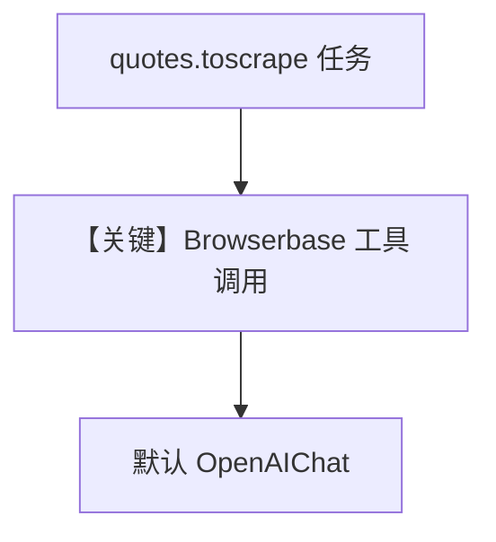

# browserbase_tools.py — 实现原理分析

<!-- cookbook-py-source:start -->
## 完整源码

```python
"""
Browserbase Tools
=============================

Demonstrates browserbase tools.
"""

from agno.agent import Agent
from agno.tools.browserbase import BrowserbaseTools

# ---------------------------------------------------------------------------
# Create Agent
# ---------------------------------------------------------------------------


# Browserbase Configuration
# -------------------------------
# These environment variables are required for the BrowserbaseTools to function properly.
# You can set them in your .env file or export them directly in your terminal.

# BROWSERBASE_API_KEY: Your API key from Browserbase dashboard
#   - Required for authentication
#   - Format: Starts with "bb_live_" or "bb_test_" followed by a unique string

# BROWSERBASE_PROJECT_ID: The project ID from your Browserbase dashboard
#   - Required to identify which project to use for browser sessions
#   - Format: UUID string (8-4-4-4-12 format)

# BROWSERBASE_BASE_URL: The Browserbase API endpoint
#   - Optional: Defaults to https://api.browserbase.com if not specified
#   - Only change this if you're using a custom API endpoint or proxy

# ==================== Usage ====================
# BrowserbaseTools automatically uses the correct implementation based on context:
# - Sync tools when using agent.run() or agent.print_response()
# - Async tools when using agent.arun() or agent.aprint_response()

agent = Agent(
    name="Web Automation Assistant",
    tools=[BrowserbaseTools()],
    instructions=[
        "You are a web automation assistant that can help with:",
        "1. Capturing screenshots of websites",
        "2. Extracting content from web pages",
        "3. Monitoring website changes",
        "4. Taking visual snapshots of responsive layouts",
        "5. Automated web testing and verification",
    ],
    markdown=True,
)

# ==================== Sync Usage ====================
# Use this for regular scripts and synchronous execution

# Content Extraction and SS
# agent.print_response("""
#     Go to https://news.ycombinator.com and extract:
#     1. The page title
#     2. Take a screenshot of the top stories section
# """)

# ---------------------------------------------------------------------------
# Run Agent
# ---------------------------------------------------------------------------
if __name__ == "__main__":
    agent.print_response("""
        Visit https://quotes.toscrape.com and:
        1. Extract the first 5 quotes and their authors
        2. Navigate to page 2
        3. Extract the first 5 quotes from page 2
    """)

    # ==================== Async Usage ====================
    # Use this for FastAPI, async frameworks, or when using agent.arun()
    # The same agent instance works for both sync and async - just use arun/aprint_response!

    # import asyncio
    #
    #
    # async def main():
    #     # Same agent, just use async methods - it will automatically use async tools
    #     await agent.aprint_response("""
    #         Visit https://quotes.toscrape.com and:
    #         1. Extract the first 5 quotes and their authors
    #         2. Navigate to page 2
    #         3. Extract the first 5 quotes from page 2
    #     """)
    #
    #
    # if __name__ == "__main__":
    #     asyncio.run(main())
```

<!-- cookbook-py-source:end -->

> 源文件：`cookbook/91_tools/browserbase_tools.py`

## 概述

本示例展示 **BrowserbaseTools**：云端浏览器自动化（截图、提取内容等），需 **`BROWSERBASE_API_KEY`**、**`BROWSERBASE_PROJECT_ID`** 等环境变量；Agent 仅显式配置 **`name`**、**`instructions`**、**`markdown`**，**未显式传 `model`**，首次运行将由 **`set_default_model`** 设为 **`OpenAIChat(id="gpt-4o")`**（`agno/agent/_init.py` L66-78）。

**核心配置一览：**

| 配置项 | 值 | 说明 |
|--------|------|------|
| `model` | `None`（运行时默认 `OpenAIChat("gpt-4o")`） | 未在源码中显式写出 |
| `name` | `"Web Automation Assistant"` | 若 `add_name_to_context` 未开则不注入 |
| `tools` | `[BrowserbaseTools()]` | 浏览器能力 |
| `instructions` | 列表（自动化/截图等 5 条） | 写入 system |
| `markdown` | `True` | 是 |

## 架构分层

同步 `print_response` 走同步工具实现；注释说明异步场景用 `arun`/`aprint_response` 走 async 工具路径。

## 核心组件解析

### BrowserbaseTools

封装 Browserbase API；与 Playwright 类似但远程会话。

### 运行机制与因果链

1. **路径**：多步导航与提取 → 可能多轮工具调用。
2. **副作用**：Browserbase 侧会话与计费。
3. **分支**：sync vs async 调用链。
4. **定位**：**远程浏览器** 与 Agno 工具栈集成。

## System Prompt 组装

### 还原后的完整 System 文本（instructions 须对照源码）

instructions 为列表多行，请直接引用 `browserbase_tools.py` 中 L41-47 原文；另含：

```text
Use markdown to format your answers.
```

## 完整 API 请求

默认 `gpt-4o` + `tools` 为 Browserbase 工具 JSON schema。

## Mermaid 流程图



## 关键源码文件索引

| 文件 | 关键函数/类 | 作用 |
|------|------------|------|
| `agno/agent/_init.py` | `set_default_model` L66+ | 默认模型 |
| `agno/tools/browserbase/` | `BrowserbaseTools` | 工具实现 |
