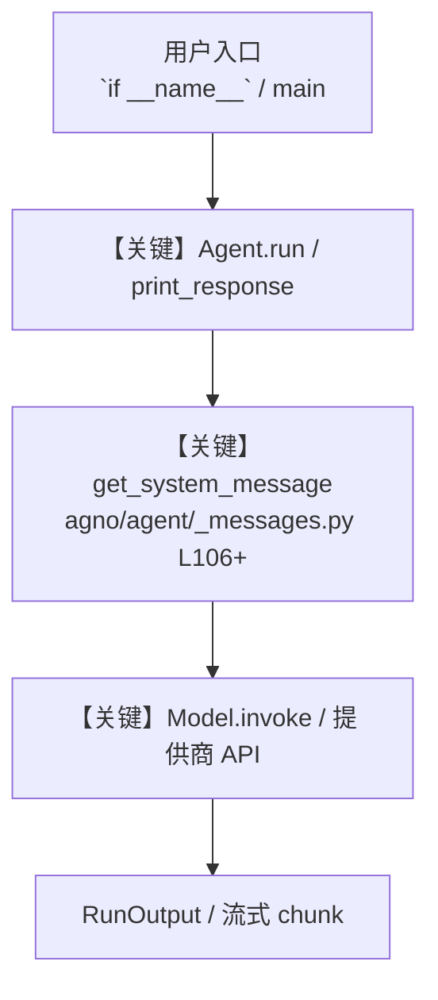

# csv_tools.py — 实现原理分析

<!-- cookbook-py-source:start -->
## 完整源码

```python
"""
CSV Tools - Data Analysis and Processing for CSV Files

This example demonstrates how to use CsvTools for CSV file operations.
Shows enable_ flag patterns for selective function access.
CsvTools is a small tool (<6 functions) so it uses enable_ flags.

Run: `uv pip install pandas` to install the dependencies
"""

from pathlib import Path

import httpx
from agno.agent import Agent
from agno.tools.csv_toolkit import CsvTools

# ---------------------------------------------------------------------------
# Create Agent
# ---------------------------------------------------------------------------


# Download sample data
url = "https://agno-public.s3.amazonaws.com/demo_data/IMDB-Movie-Data.csv"
response = httpx.get(url)

imdb_csv = Path(__file__).parent.joinpath("imdb.csv")

# ---------------------------------------------------------------------------
# Run Agent
# ---------------------------------------------------------------------------
if __name__ == "__main__":
    imdb_csv.parent.mkdir(parents=True, exist_ok=True)
    imdb_csv.write_bytes(response.content)

    # Example 1: All functions enabled (default behavior)
    agent_full = Agent(
        tools=[CsvTools(csvs=[imdb_csv])],  # All functions enabled by default
        description="You are a comprehensive CSV data analyst with all processing capabilities.",
        instructions=[
            "Help users with complete CSV data analysis and processing",
            "First always get the list of files",
            "Then check the columns in the file",
            "Run queries and provide detailed analysis",
            "Support all CSV operations and transformations",
        ],
        markdown=True,
    )

    # Example 2: Enable specific functions for read-only analysis
    agent_readonly = Agent(
        tools=[
            CsvTools(
                csvs=[imdb_csv],
                enable_list_csv_files=True,
                enable_get_columns=True,
                enable_query_csv_file=True,
            )
        ],
        description="You are a CSV data analyst focused on reading and analyzing existing data.",
        instructions=[
            "Analyze existing CSV files without modifications",
            "Provide insights and run analytical queries",
            "Cannot create or modify CSV files",
            "Focus on data exploration and reporting",
        ],
        markdown=True,
    )

    # Example 3: Enable all functions using 'all=True' pattern
    agent_comprehensive = Agent(
        tools=[CsvTools(csvs=[imdb_csv], all=True)],
        description="You are a full-featured CSV processing expert with all capabilities.",
        instructions=[
            "Perform comprehensive CSV data operations",
            "Create, modify, analyze, and transform CSV files",
            "Support advanced data processing workflows",
            "Provide end-to-end CSV data management",
        ],
        markdown=True,
    )

    # Example 4: Query-focused agent
    agent_query = Agent(
        tools=[
            CsvTools(
                csvs=[imdb_csv],
                enable_list_csv_files=True,
                enable_get_columns=True,
                enable_query_csv_file=True,
            )
        ],
        description="You are a CSV query specialist focused on data analysis and reporting.",
        instructions=[
            "Execute analytical queries on CSV data",
            "Provide statistical insights and summaries",
            "Generate reports based on data analysis",
            "Focus on extracting valuable insights from datasets",
        ],
        markdown=True,
    )

    print("=== Full CSV Analysis Example ===")
    print("Using comprehensive agent for complete CSV operations")
    agent_full.print_response(
        "Analyze the IMDB movie dataset. Show me the top 10 highest-rated movies and their directors.",
        markdown=True,
    )

    print("\n=== Read-Only Analysis Example ===")
    print("Using read-only agent for data exploration")
    agent_readonly.print_response(
        "What are the key statistics about the movie ratings and revenue in this dataset?",
        markdown=True,
    )

    print("\n=== Query-Focused Example ===")
    print("Using query specialist for targeted analysis")
    agent_query.print_response(
        "Find movies from the year 2016 with ratings above 8.0 and show their genres.",
        markdown=True,
    )

    # Optional: Interactive CLI mode
    # agent_full.cli_app(stream=False)
```

<!-- cookbook-py-source:end -->

> 源文件：`cookbook/91_tools/csv_tools.py`

## 概述

CSV Tools - Data Analysis and Processing for CSV Files

本示例归类：**单 Agent**；模型相关类型：`（见源码 import）`。

**核心配置一览：**

| 配置项 | 值 | 说明 |
|--------|------|------|
| `description` | 'You are a comprehensive CSV data analyst with all processing capabilities.' | `Agent(...)` |
| `markdown` | True | `Agent(...)` |

## 架构分层

```
用户 / cookbook 示例              Agno 框架
┌──────────────────────┐         ┌────────────────────────────────┐
│ csv_tools.py         │  ──▶  │ Agent → get_run_messages → Model │
└──────────────────────┘         └────────────────────────────────┘
                                          │
                                          ▼
                                  ┌───────────────┐
                                  │ 对应 Model 子类 │
                                  └───────────────┘
```

## 核心组件解析

### 运行机制与因果链

1. **入口**：从模块 `__main__` 或暴露的 `agent` / `team` 调用进入；同步用 `print_response` / `run`，异步用 `aprint_response` / `arun`（若源码中有）。
2. **消息**：默认路径下 system 内容由 `get_system_message()`（`libs/agno/agno/agent/_messages.py` 约 **L106** 起）按分段逻辑拼装；若显式传入 `system_message` 则早退使用该字符串。
3. **模型**：具体 HTTP/SDK 形态以 `libs/agno/agno/models/` 下对应类的 `invoke` / `ainvoke` 为准（勿默认写成单一 `chat.completions`）。
4. **副作用**：若配置 `db`、`knowledge`、`memory`，运行会读写存储；仅以本文件为准对照。

### 与框架的衔接

- **System**：`get_system_message()` 锚点 `agno/agent/_messages.py` **L106+**。
- **运行**：`Agent.print_response` 等入口 `agno/agent/agent.py`（以当前仓库检索为准）。

## System Prompt 组装

| 序号 | 组成部分 | 本文件 | 是否生效 |
|------|---------|--------|---------|
| 1 | `instructions` / `description` 等 | 见核心配置表与源码 | 有赋值则生效 |
| 2 | 默认分段（markdown、时间等） | 取决于 `Agent` 默认与显式参数 | 视参数 |

### 拼装顺序与源码锚点

1. `system_message` 直给 → 使用该内容（见 `_messages.py` 文档字符串分支说明）。
2. 否则默认拼装：`description`、`role`、`instructions`、markdown 附加段等按 `# 3.x` 注释顺序合并。

### 还原后的完整 System 文本

```text
--- description ---
You are a comprehensive CSV data analyst with all processing capabilities.
```

### 段落释义（模型视角）

- 指令与安全边界由 `instructions` / `system_message` 约束；若带 `tools` / `knowledge`，文档中需体现「何时检索/调用」由框架注入的提示段支持。

## 完整 API 请求

```python
# 请以本文件实际 Model 为准打开 libs/agno/agno/models/<厂商>/ 下对应类的 invoke：
# 可能是 chat.completions.create、responses.create、Gemini generate_content 等。
```

> 与上一节 system 文本在同一 run 中组合；`developer`/`system` 角色由适配器转换。



**【关键】节点说明：**

- **print_response / run**：用户可见的同步入口。
- **get_system_message**：系统提示拼装核心。
- **Model.invoke**：对模型提供商的实际请求。

## 关键源码文件索引

| 文件 | 作用 |
|------|------|
| `agno/agent/_messages.py` | `get_system_message()` L106+ |
| `agno/agent/agent.py` | `Agent` 运行与 CLI 输出 |
| `agno/models/` | 各厂商 `Model.invoke` |
