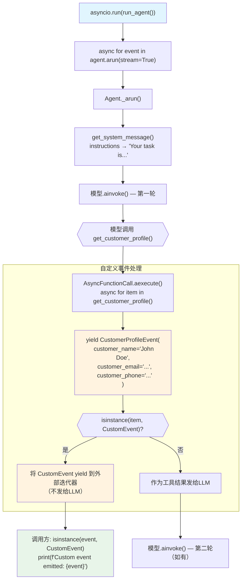

# custom_tool_events.py — 实现原理分析

> 源文件：`cookbook/91_tools/custom_tool_events.py`

## 概述

本示例展示 Agno 的 **`CustomEvent` 自定义事件**机制：工具函数可以通过 `yield` 产生 `CustomEvent` 子类实例，在 `stream_events=True` 模式下（通过 `agent.arun(..., stream=True)` 的异步迭代器）被调用方捕获处理。这允许工具在执行过程中向调用方实时推送结构化事件，而不仅仅是最终结果。

**核心配置一览：**

| 配置项 | 值 | 说明 |
|--------|------|------|
| `model` | `OpenAIChat(id="gpt-4o")` | Chat Completions API |
| `tools` | `[get_customer_profile]` | 产生 CustomEvent 的异步工具 |
| `instructions` | `"Your task is to retrieve customer profiles..."` | 工具使用指令 |
| `CustomEvent` | `CustomerProfileEvent(customer_name, email, phone)` | 自定义事件类型 |
| 事件消费 | `async for event in agent.arun(...)` | 迭代捕获自定义事件 |

## 架构分层

```
用户代码层                      agno.agent 层
┌─────────────────────────┐    ┌────────────────────────────────────┐
│ custom_tool_events.py   │    │ Agent._arun() (stream=True)        │
│                         │    │  ├─ 模型.ainvoke()                 │
│ @dataclass              │    │  │                                  │
│ class CustomerProfile   │    │  └─ AsyncFunctionCall.aexecute()   │
│   Event(CustomEvent):   │───>│      async for item in tool():     │
│   customer_name: str    │    │        if isinstance(item, Custom  │
│   customer_email: str   │    │           Event):                  │
│   customer_phone: str   │    │          yield item  ←─── 向外emit │
│                         │    └────────────────────────────────────┘
│ @tool()                 │                  │
│ async def get_profile():│                  │ yield CustomEvent
│   yield CustomerProfile │                  ▼
│     Event(...)          │    ┌────────────────────────────────┐
│                         │    │ async for event in agent.arun()│
│ async for event in      │    │   if isinstance(event, Custom  │
│   agent.arun(stream=True│    │      Event): print(event)      │
│ ):                      │    └────────────────────────────────┘
│   if CustomEvent: print │
└─────────────────────────┘
```

## 核心组件解析

### CustomEvent 基类

```python
from agno.run.agent import CustomEvent

@dataclass
class CustomerProfileEvent(CustomEvent):
    """CustomEvent for customer profile."""
    customer_name: Optional[str] = None
    customer_email: Optional[str] = None
    customer_phone: Optional[str] = None
```

`CustomEvent` 是 Agno 提供的事件基类（`run/agent.py`），继承后可携带任意结构化数据。工具函数通过 `yield` 产生这些事件实例。

### 工具函数 yield CustomEvent

```python
@tool()
async def get_customer_profile():
    """Example custom tool that simply yields a custom event."""
    
    yield CustomerProfileEvent(
        customer_name="John Doe",
        customer_email="john.doe@example.com",
        customer_phone="1234567890",
    )
```

工具函数是异步生成器，`yield` 的是 `CustomEvent` 实例而非工具结果字符串。框架在 `AsyncFunctionCall.aexecute()` 中特殊处理 `CustomEvent`：将其传播到外部迭代器，不作为工具结果字符串传给 LLM。

### 事件消费模式

```python
async def run_agent():
    async for event in agent.arun(
        "Hello, can you get me the customer profile for customer with ID 123?",
        stream=True,
    ):
        if isinstance(event, CustomEvent):
            print(f"Custom event emitted: {event}")
```

`agent.arun(..., stream=True)` 返回异步迭代器，产出所有事件（包括 LLM token、工具事件、自定义事件等）。调用方通过 `isinstance` 过滤感兴趣的事件类型。

### CustomEvent 与普通工具结果的区别

| 类型 | 传递给 LLM | 调用方可见 | 典型用途 |
|------|-----------|----------|---------|
| 普通字符串 yield/return | 是（作为工具结果） | 是（在工具调用消息中） | 工具执行结果 |
| `CustomEvent` yield | 否（不发给 LLM） | 是（通过事件迭代器） | 实时进度通知、结构化数据推送 |

## System Prompt 组装

| 序号 | 组成部分 | 本文件中的值/来源 | 是否生效 |
|------|---------|-----------------|---------|
| 1 | `system_message` | `None` | 否 |
| 3.1 | `instructions` | `"Your task is to retrieve customer profiles for the user."` | 是 |
| 3.1.1 | 模型指令 | 模型特定指令 | 是 |
| 3.2.1 | `markdown` | `None` | 否 |
| 3.3.3 | instructions 拼接 | 写入 system message | 是 |

### 最终 System Prompt

```text
Your task is to retrieve customer profiles for the user.
```

## 完整 API 请求

```python
client.chat.completions.create(
    model="gpt-4o",
    messages=[
        {"role": "system", "content": "Your task is to retrieve customer profiles for the user."},
        {"role": "user", "content": "Hello, can you get me the customer profile for customer with ID 123?"}
    ],
    tools=[
        {
            "type": "function",
            "function": {
                "name": "get_customer_profile",
                "description": "Example custom tool that simply yields a custom event.",
                "parameters": {"type": "object", "properties": {}, "required": []}
            }
        }
    ],
    stream=True
)
# 工具执行：yield CustomerProfileEvent(...)
# → CustomEvent 通过事件迭代器传递给调用方
# → 不作为工具结果发给 LLM（LLM 看到工具返回值为空或特定占位符）
```

## Mermaid 流程图



## 关键源码文件索引

| 文件 | 关键函数/类 | 作用 |
|------|------------|------|
| `agno/run/agent.py` | `CustomEvent` | 自定义事件基类 |
| `agno/tools/decorator.py` | `tool()` L87 | 装饰异步生成器工具 |
| `agno/tools/function.py` | `AsyncFunctionCall.aexecute()` | 处理 CustomEvent yield |
| `agno/agent/agent.py` | `Agent.arun()` | 返回异步事件迭代器 |
| `agno/run/agent.py` | `RunEvent` L134 | 事件类型枚举 |
