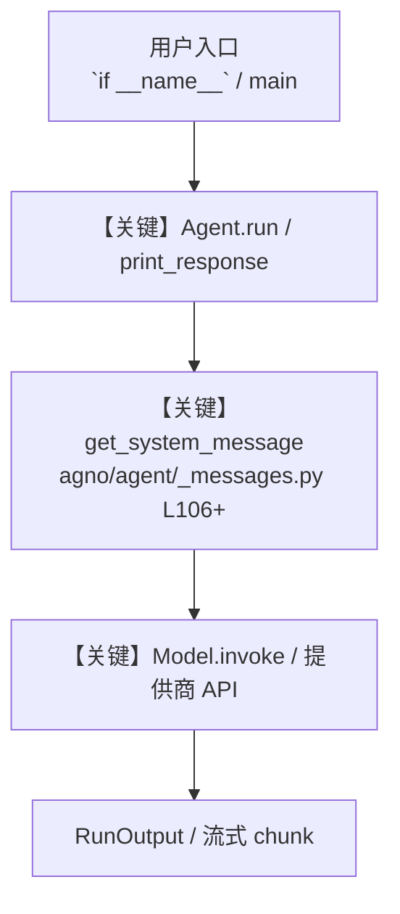

# duckduckgo_tools_advanced.py — 实现原理分析

<!-- cookbook-py-source:start -->
## 完整源码

```python
"""
DuckDuckGo Tools - Advanced Configuration
==========================================

Demonstrates advanced DuckDuckGoTools configuration with timelimit, region,
and backend parameters for customized search behavior.

Parameters:
    - timelimit: Filter results by time ("d" = day, "w" = week, "m" = month, "y" = year)
    - region: Localize results (e.g., "us-en", "uk-en", "de-de", "fr-fr", "ru-ru")
    - backend: Search backend ("api", "html", "lite")
"""

from agno.agent import Agent
from agno.models.openai import OpenAIChat
from agno.tools.duckduckgo import DuckDuckGoTools

# ---------------------------------------------------------------------------
# Example 1: Time-limited search (results from past week)
# ---------------------------------------------------------------------------
# Useful for finding recent news, updates, or time-sensitive information

weekly_search_agent = Agent(
    model=OpenAIChat(id="gpt-4o"),
    tools=[
        DuckDuckGoTools(
            timelimit="w",  # Results from past week only
            enable_search=True,
            enable_news=True,
        )
    ],
    instructions=["Search for recent information from the past week."],
)

# ---------------------------------------------------------------------------
# Example 2: Region-specific search (US English results)
# ---------------------------------------------------------------------------
# Useful for localized results based on user's region

us_region_agent = Agent(
    model=OpenAIChat(id="gpt-4o"),
    tools=[
        DuckDuckGoTools(
            region="us-en",  # US English results
            enable_search=True,
            enable_news=True,
        )
    ],
    instructions=["Search for information with US-localized results."],
)

# ---------------------------------------------------------------------------
# Example 3: Different backend options
# ---------------------------------------------------------------------------
# The backend parameter controls how DuckDuckGo is queried

# API backend - uses DuckDuckGo's API
api_backend_agent = Agent(
    model=OpenAIChat(id="gpt-4o"),
    tools=[
        DuckDuckGoTools(
            backend="api",
            enable_search=True,
            enable_news=True,
        )
    ],
)

# HTML backend - parses HTML results
html_backend_agent = Agent(
    model=OpenAIChat(id="gpt-4o"),
    tools=[
        DuckDuckGoTools(
            backend="html",
            enable_search=True,
            enable_news=True,
        )
    ],
)

# Lite backend - lightweight parsing
lite_backend_agent = Agent(
    model=OpenAIChat(id="gpt-4o"),
    tools=[
        DuckDuckGoTools(
            backend="lite",
            enable_search=True,
            enable_news=True,
        )
    ],
)

# ---------------------------------------------------------------------------
# Example 4: Combined configuration - Full customization
# ---------------------------------------------------------------------------
# Combine all parameters for maximum control over search behavior

fully_configured_agent = Agent(
    model=OpenAIChat(id="gpt-4o"),
    tools=[
        DuckDuckGoTools(
            timelimit="w",  # Results from past week
            region="us-en",  # US English results
            backend="api",  # Use API backend
            enable_search=True,
            enable_news=True,
            fixed_max_results=10,  # Limit to 10 results
            timeout=15,  # 15 second timeout
        )
    ],
    instructions=[
        "You are a research assistant that finds recent US news and information.",
        "Always provide sources for your findings.",
    ],
)

# ---------------------------------------------------------------------------
# Example 5: European region search with monthly timelimit
# ---------------------------------------------------------------------------

eu_monthly_agent = Agent(
    model=OpenAIChat(id="gpt-4o"),
    tools=[
        DuckDuckGoTools(
            timelimit="m",  # Results from past month
            region="de-de",  # German results
            enable_search=True,
            enable_news=True,
        )
    ],
    instructions=["Search for information with German-localized results."],
)

# ---------------------------------------------------------------------------
# Example 6: Daily news search
# ---------------------------------------------------------------------------
# Perfect for finding breaking news and today's updates

daily_news_agent = Agent(
    model=OpenAIChat(id="gpt-4o"),
    tools=[
        DuckDuckGoTools(
            timelimit="d",  # Results from past day only
            enable_search=False,  # Disable web search
            enable_news=True,  # Enable news only
        )
    ],
    instructions=[
        "You are a news assistant that finds today's breaking news.",
        "Focus on the most recent and relevant stories.",
    ],
)

# ---------------------------------------------------------------------------
# Run Examples
# ---------------------------------------------------------------------------
if __name__ == "__main__":
    # Example 1: Weekly search
    print("\n" + "=" * 60)
    print("Example 1: Time-limited search (past week)")
    print("=" * 60)
    weekly_search_agent.print_response(
        "What are the latest developments in AI?", markdown=True
    )

    # Example 2: US region search
    print("\n" + "=" * 60)
    print("Example 2: Region-specific search (US English)")
    print("=" * 60)
    us_region_agent.print_response("What are the trending tech topics?", markdown=True)

    # Example 3: API backend
    print("\n" + "=" * 60)
    print("Example 3: API backend")
    print("=" * 60)
    api_backend_agent.print_response("What is quantum computing?", markdown=True)

    # Example 4: Fully configured agent
    print("\n" + "=" * 60)
    print("Example 4: Fully configured agent (weekly, US, API backend)")
    print("=" * 60)
    fully_configured_agent.print_response(
        "Find recent news about renewable energy in the US", markdown=True
    )

    # Example 5: European region with monthly timelimit
    print("\n" + "=" * 60)
    print("Example 5: European region (German) with monthly timelimit")
    print("=" * 60)
    eu_monthly_agent.print_response(
        "What are the latest technology trends?", markdown=True
    )

    # Example 6: Daily news
    print("\n" + "=" * 60)
    print("Example 6: Daily news search")
    print("=" * 60)
    daily_news_agent.print_response(
        "What are today's top headlines in technology?", markdown=True
    )
```

<!-- cookbook-py-source:end -->

> 源文件：`cookbook/91_tools/duckduckgo_tools_advanced.py`

## 概述

DuckDuckGo Tools - Advanced Configuration

本示例归类：**单 Agent**；模型相关类型：`OpenAIChat`。

**核心配置一览：**

| 配置项 | 值 | 说明 |
|--------|------|------|
| `model` | OpenAIChat(id='gpt-4o'…) | `Agent(...)` |
| （Model 类） | `OpenAIChat` | `agno.models` |

## 架构分层

```
用户 / cookbook 示例              Agno 框架
┌──────────────────────┐         ┌────────────────────────────────┐
│ duckduckgo_tools_advanced.py │  ──▶  │ Agent → get_run_messages → Model │
└──────────────────────┘         └────────────────────────────────┘
                                          │
                                          ▼
                                  ┌───────────────┐
                                  │ 对应 Model 子类 │
                                  └───────────────┘
```

## 核心组件解析

### 运行机制与因果链

1. **入口**：从模块 `__main__` 或暴露的 `agent` / `team` 调用进入；同步用 `print_response` / `run`，异步用 `aprint_response` / `arun`（若源码中有）。
2. **消息**：默认路径下 system 内容由 `get_system_message()`（`libs/agno/agno/agent/_messages.py` 约 **L106** 起）按分段逻辑拼装；若显式传入 `system_message` 则早退使用该字符串。
3. **模型**：具体 HTTP/SDK 形态以 `libs/agno/agno/models/` 下对应类的 `invoke` / `ainvoke` 为准（勿默认写成单一 `chat.completions`）。
4. **副作用**：若配置 `db`、`knowledge`、`memory`，运行会读写存储；仅以本文件为准对照。

### 与框架的衔接

- **System**：`get_system_message()` 锚点 `agno/agent/_messages.py` **L106+**。
- **运行**：`Agent.print_response` 等入口 `agno/agent/agent.py`（以当前仓库检索为准）。

## System Prompt 组装

| 序号 | 组成部分 | 本文件 | 是否生效 |
|------|---------|--------|---------|
| 1 | `instructions` / `description` 等 | 见核心配置表与源码 | 有赋值则生效 |
| 2 | 默认分段（markdown、时间等） | 取决于 `Agent` 默认与显式参数 | 视参数 |

### 拼装顺序与源码锚点

1. `system_message` 直给 → 使用该内容（见 `_messages.py` 文档字符串分支说明）。
2. 否则默认拼装：`description`、`role`、`instructions`、markdown 附加段等按 `# 3.x` 注释顺序合并。

### 还原后的完整 System 文本

```text
（主 `Agent(...)` 未传入可静态解析的 `description`/`instructions`/`system_message` 字符串；此时 system 由 `get_system_message()` 默认段与 `markdown` 等开关决定，请在 `agno/agent/_messages.py` 对照分段注释，或在运行中打印 `get_system_message` 返回值。）
```

### 段落释义（模型视角）

- 指令与安全边界由 `instructions` / `system_message` 约束；若带 `tools` / `knowledge`，文档中需体现「何时检索/调用」由框架注入的提示段支持。

## 完整 API 请求

```python
# 请以本文件实际 Model 为准打开 libs/agno/agno/models/<厂商>/ 下对应类的 invoke：
# 可能是 chat.completions.create、responses.create、Gemini generate_content 等。
```

> 与上一节 system 文本在同一 run 中组合；`developer`/`system` 角色由适配器转换。



**【关键】节点说明：**

- **print_response / run**：用户可见的同步入口。
- **get_system_message**：系统提示拼装核心。
- **Model.invoke**：对模型提供商的实际请求。

## 关键源码文件索引

| 文件 | 作用 |
|------|------|
| `agno/agent/_messages.py` | `get_system_message()` L106+ |
| `agno/agent/agent.py` | `Agent` 运行与 CLI 输出 |
| `agno/models/` | 各厂商 `Model.invoke` |
