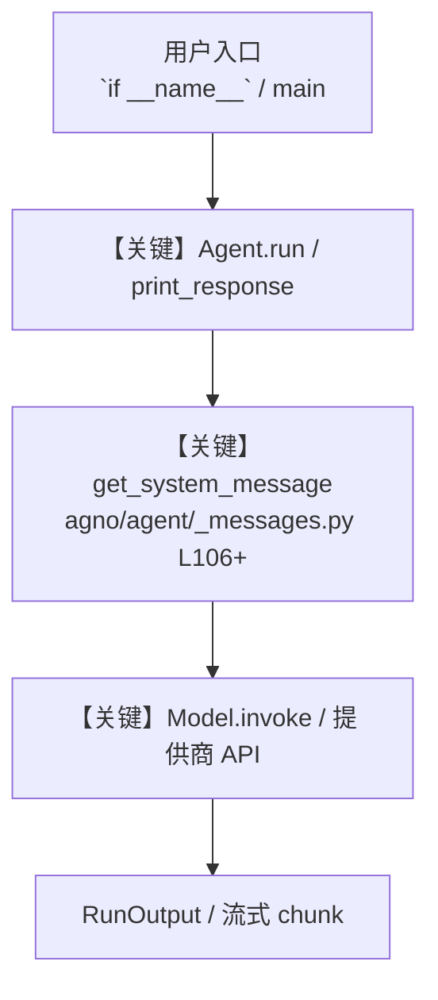

# e2b_tools.py — 实现原理分析

<!-- cookbook-py-source:start -->
## 完整源码

```python
"""
E2B Tools Example - Demonstrates how to use the E2B toolkit for sandboxed code execution.

This example shows how to:
1. Set up authentication with E2B API
2. Initialize the E2BTools with proper configuration
3. Create an agent that can run Python code in a secure sandbox
4. Use the sandbox for data analysis, visualization, and more

Prerequisites:
1. Create an account and get your API key from E2B:
   - Visit https://e2b.dev/
   - Sign up for an account
   - Navigate to the Dashboard to get your API key

2. Install required packages:
   uv pip install e2b_code_interpreter pandas matplotlib

3. Set environment variable:
   export E2B_API_KEY=your_api_key

Features:
- Run Python code in a secure sandbox environment
- Upload and download files to/from the sandbox
- Create and download data visualizations
- Run servers within the sandbox with public URLs
- Manage sandbox lifecycle (timeout, shutdown)
- Access the internet from within the sandbox

Usage:
Run this script with the E2B_API_KEY environment variable set to interact
with the E2B sandbox through natural language commands.
"""

from agno.agent import Agent
from agno.models.openai import OpenAIChat
from agno.tools.e2b import E2BTools

# ---------------------------------------------------------------------------
# Create Agent
# ---------------------------------------------------------------------------


# Example 1: Include specific E2B functions for basic code execution
basic_e2b_tools = E2BTools(
    timeout=600,  # 10 minutes timeout (in seconds)
    include_tools=[
        "run_python_code",
        "list_files",
        "read_file_content",
        "write_file_content",
    ],
)

# Example 2: Exclude server-related functions for security
safe_e2b_tools = E2BTools(
    timeout=600, exclude_tools=["run_server", "get_public_url", "run_command"]
)

# Example 3: Full E2B functionality (default)
full_e2b_tools = E2BTools(
    timeout=600,  # 10 minutes timeout (in seconds)
)

# Create agents with different tool configurations
basic_agent = Agent(
    name="Basic Code Execution Sandbox",
    id="e2b-basic-sandbox",
    model=OpenAIChat(id="gpt-4o"),
    tools=[basic_e2b_tools],
    markdown=True,
    instructions=[
        "You are a Python code execution assistant with basic file operations.",
        "You can run Python code and manage files in a secure sandbox.",
    ],
)

agent = Agent(
    name="Full Code Execution Sandbox",
    id="e2b-sandbox",
    model=OpenAIChat(id="gpt-4o"),
    tools=[full_e2b_tools],
    markdown=True,
    instructions=[
        "You are an expert at writing and validating Python code using a secure E2B sandbox environment.",
        "Your primary purpose is to:",
        "1. Write clear, efficient Python code based on user requests",
        "2. Execute and verify the code in the E2B sandbox",
        "3. Share the complete code with the user, as this is the main use case",
        "4. Provide thorough explanations of how the code works",
        "",
        "You can use these tools:",
        "1. Run Python code (run_python_code)",
        "2. Upload files to the sandbox (upload_file)",
        "3. Download files from the sandbox (download_file_from_sandbox)",
        "4. Generate and add visualizations as image artifacts (download_png_result)",
        "5. List files in the sandbox (list_files)",
        "6. Read and write file content (read_file_content, write_file_content)",
        "7. Start web servers and get public URLs (run_server, get_public_url)",
        "8. Manage the sandbox lifecycle (set_sandbox_timeout, get_sandbox_status, shutdown_sandbox)",
        "",
        "Guidelines:",
        "- ALWAYS share the complete code with the user, properly formatted in code blocks",
        "- Verify code functionality by executing it in the sandbox before sharing",
        "- Iterate and debug code as needed to ensure it works correctly",
        "- Use pandas, matplotlib, and other Python libraries for data analysis when appropriate",
        "- Create proper visualizations when requested and add them as image artifacts to show inline",
        "- Handle file uploads and downloads properly",
        "- Explain your approach and the code's functionality in detail",
        "- Format responses with both code and explanations for maximum clarity",
        "- Handle errors gracefully and explain any issues encountered",
    ],
)

# ---------------------------------------------------------------------------
# Run Agent
# ---------------------------------------------------------------------------
if __name__ == "__main__":
    agent.print_response(
        "Write Python code to generate the first 10 Fibonacci numbers and calculate their sum and average"
    )

    # agent.print_response(
    #     " upload file cookbook/90_tools/sample_data.csv and use it to create a matplotlib visualization of total sales by region and provide chart image or its downloaded path or any link  "
    # )
    # agent.print_response(" use dataset sample_data.csv and create a matplotlib visualization of total sales by region and provide chart image")
    # agent.print_response(" run a server and Write a simple fast api web server that displays 'Hello from E2B Sandbox!' and run it , use run_command to get the data from the server and provide the  url of api swagger docs and host link")
    # agent.print_response(
    #     " run server and Create and run a Python script that fetch top 5 latest news from hackernews using hackernews api"
    # )
    # agent.print_response("Extend the sandbox timeout to 20 minutes")
    # agent.print_response("list all sandboxes ")
```

<!-- cookbook-py-source:end -->

> 源文件：`cookbook/91_tools/e2b_tools.py`

## 概述

E2B Tools Example - Demonstrates how to use the E2B toolkit for sandboxed code execution.

本示例归类：**单 Agent**；模型相关类型：`OpenAIChat`。

**核心配置一览：**

| 配置项 | 值 | 说明 |
|--------|------|------|
| `name` | 'Full Code Execution Sandbox' | `Agent(...)` |
| `id` | 'e2b-sandbox' | `Agent(...)` |
| `model` | OpenAIChat(id='gpt-4o'…) | `Agent(...)` |
| `markdown` | True | `Agent(...)` |
| （Model 类） | `OpenAIChat` | `agno.models` |

## 架构分层

```
用户 / cookbook 示例              Agno 框架
┌──────────────────────┐         ┌────────────────────────────────┐
│ e2b_tools.py         │  ──▶  │ Agent → get_run_messages → Model │
└──────────────────────┘         └────────────────────────────────┘
                                          │
                                          ▼
                                  ┌───────────────┐
                                  │ 对应 Model 子类 │
                                  └───────────────┘
```

## 核心组件解析

### 运行机制与因果链

1. **入口**：从模块 `__main__` 或暴露的 `agent` / `team` 调用进入；同步用 `print_response` / `run`，异步用 `aprint_response` / `arun`（若源码中有）。
2. **消息**：默认路径下 system 内容由 `get_system_message()`（`libs/agno/agno/agent/_messages.py` 约 **L106** 起）按分段逻辑拼装；若显式传入 `system_message` 则早退使用该字符串。
3. **模型**：具体 HTTP/SDK 形态以 `libs/agno/agno/models/` 下对应类的 `invoke` / `ainvoke` 为准（勿默认写成单一 `chat.completions`）。
4. **副作用**：若配置 `db`、`knowledge`、`memory`，运行会读写存储；仅以本文件为准对照。

### 与框架的衔接

- **System**：`get_system_message()` 锚点 `agno/agent/_messages.py` **L106+**。
- **运行**：`Agent.print_response` 等入口 `agno/agent/agent.py`（以当前仓库检索为准）。

## System Prompt 组装

| 序号 | 组成部分 | 本文件 | 是否生效 |
|------|---------|--------|---------|
| 1 | `instructions` / `description` 等 | 见核心配置表与源码 | 有赋值则生效 |
| 2 | 默认分段（markdown、时间等） | 取决于 `Agent` 默认与显式参数 | 视参数 |

### 拼装顺序与源码锚点

1. `system_message` 直给 → 使用该内容（见 `_messages.py` 文档字符串分支说明）。
2. 否则默认拼装：`description`、`role`、`instructions`、markdown 附加段等按 `# 3.x` 注释顺序合并。

### 还原后的完整 System 文本

```text
（主 `Agent(...)` 未传入可静态解析的 `description`/`instructions`/`system_message` 字符串；此时 system 由 `get_system_message()` 默认段与 `markdown` 等开关决定，请在 `agno/agent/_messages.py` 对照分段注释，或在运行中打印 `get_system_message` 返回值。）
```

### 段落释义（模型视角）

- 指令与安全边界由 `instructions` / `system_message` 约束；若带 `tools` / `knowledge`，文档中需体现「何时检索/调用」由框架注入的提示段支持。

## 完整 API 请求

```python
# 请以本文件实际 Model 为准打开 libs/agno/agno/models/<厂商>/ 下对应类的 invoke：
# 可能是 chat.completions.create、responses.create、Gemini generate_content 等。
```

> 与上一节 system 文本在同一 run 中组合；`developer`/`system` 角色由适配器转换。



**【关键】节点说明：**

- **print_response / run**：用户可见的同步入口。
- **get_system_message**：系统提示拼装核心。
- **Model.invoke**：对模型提供商的实际请求。

## 关键源码文件索引

| 文件 | 作用 |
|------|------|
| `agno/agent/_messages.py` | `get_system_message()` L106+ |
| `agno/agent/agent.py` | `Agent` 运行与 CLI 输出 |
| `agno/models/` | 各厂商 `Model.invoke` |
